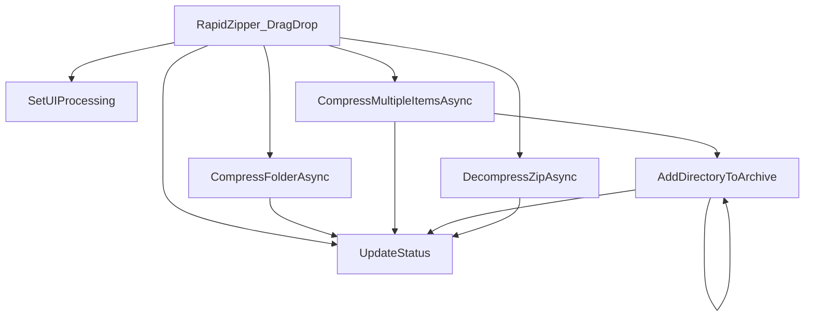

# [C#] Form1 (RapidZipper) 変数・関数仕様書

本ドキュメントは、[Form1.cs](file:///c:/Users/rikui/Documents/VSCode/%E3%83%A9%E3%83%94%E3%83%83%E3%83%89%E5%9C%A7%E7%B8%AE%E2%9C%A7%E5%B1%95%E9%96%8B/rapid-zipper/Form1.cs)におけるクラス、関数、および主要な変数の定義と依存関係を記述します。

## 1. クラス定義

### `RapidZipper` (行 9)
- **型**: `partial class` (継承: `Form`)
- **役割**: メインのWindows Formsアプリケーション画面のコントロールとロジックを保持する部分クラス。

---

## 2. 関数定義

### `Form1_Load` (行 16)
- **型**: `private void`
- **引数**:
  - `object sender`: イベント発生元
  - `EventArgs e`: イベント引数
- **役割**: フォームロード時の初期化処理（現在はプレースホルダー）。

### `RapidZipper_DragEnter` (行 20)
- **型**: `private void`
- **引数**:
  - `object sender`: イベント発生元
  - `DragEventArgs e`: ドラッグイベント引数
- **役割**: フォームまたはパネル上にデータがドラッグされた際、ファイル（FileDrop）であれば `DragDropEffects.Copy` を設定して受け入れ状態にする。

### `RapidZipper_DragDrop` (行 32)
- **型**: `private async void`
- **引数**:
  - `object sender`: イベント発生元
  - `DragEventArgs e`: ドロップイベント引数
- **役割**: ファイルがドロップされた際、フォルダが1つなら `CompressFolderAsync` を、ZIPが1つなら `DecompressZipAsync` を実行。それ以外の複数ファイル・混在の場合は `SaveFileDialog` を表示して `CompressMultipleItemsAsync` を呼び出し、1つのZIPファイルにまとめ圧縮する。
- **依存関係**: `SetUIProcessing`, `CompressFolderAsync`, `DecompressZipAsync`, `CompressMultipleItemsAsync`, `UpdateStatus`

### `UpdateStatus` (行 119)
- **型**: `private void`
- **引数**:
  - `string message`: 表示するステータスメッセージ
- **役割**: `Statuslabel` コントロールのテキストを安全に（InvokeRequiredを考慮して）更新する。
- **影響範囲**: アプリケーション内の全ステータス表示更新

### `SetUIProcessing` (行 131)
- **型**: `private void`
- **引数**:
  - `bool isProcessing`: 処理中かどうかのフラグ
- **役割**: 処理中のプログレスバー表示の切り替え（Marqueeアニメーション開始/停止）および多重ドロップ防止のためのパネル活性制御を安全に（InvokeRequiredを考慮して）行う。
- **影響範囲**: `ProcessingBar`, `DragDropPanel`

### `CompressFolderAsync` (行 153)
- **型**: `private async Task`
- **引数**:
  - `string folderPath`: 圧縮対象フォルダの絶対パス
- **役割**: 指定された単一フォルダを、同一階層内に同名でZIP圧縮する（圧縮レベル：`Fastest`）。既存の同名ファイルがある場合は上書き。
- **依存関係**: `UpdateStatus`
- **影響範囲**: バックグラウンドスレッドでのIO処理

### `CompressMultipleItemsAsync` (行 178)
- **型**: `private async Task`
- **引数**:
  - `string[] sourcePaths`: 圧縮対象ファイル・フォルダのパス配列
  - `string destZipPath`: 出力先ZIPファイルの絶対パス
- **役割**: 指定された複数のアイテムを1つのZIPファイルにまとめて非同期で圧縮する。
- **依存関係**: `AddDirectoryToArchive`, `UpdateStatus`
- **影響範囲**: バックグラウンドスレッドでのIO・圧縮処理

### `AddDirectoryToArchive` (行 213)
- **型**: `private void`
- **引数**:
  - `ZipArchive archive`: 書き込み対象ZIPアーカイブ
  - `string sourceRootDir`: 圧縮元のベースディレクトリ
  - `string currentDir`: 現在走査中のサブディレクトリ
  - `string archivePathPrefix`: アーカイブ内でのフォルダ名プレフィックス
- **役割**: 指定されたフォルダ内の全ファイルおよびサブフォルダを再帰的（再帰呼び出し）にZIPアーカイブに追加する。
- **依存関係**: `UpdateStatus`, `AddDirectoryToArchive`（自己再帰）

### `DecompressZipAsync` (行 231)
- **型**: `private async Task`
- **引数**:
  - `string zipFilePath`: 展開対象ZIPファイルの絶対パス
- **役割**: 指定されたZIPファイルを非同期で展開する。
  - **展開先フォルダ選択**: 展開前に `FolderBrowserDialog` を表示し、ユーザーが展開先の親フォルダを自由に指定できるようにする。デフォルトはZIPと同じフォルダ。
  - OSの標準コードページ (`CultureInfo.CurrentCulture.TextInfo.ANSICodePage`) を用いてエンコーディングを自動決定し、非UTF-8 of ZIPファイルの文字化けを防止。
  - 展開先フォルダが既に存在する場合は、ダイアログを介して「上書き」「別名保存」「キャンセル」を選択させる。
  - **高速上書き対応 (Move-and-Delete)**: 上書き選択時、既存フォルダの完全削除を待たずに、一瞬でユニークな一時フォルダ名に `Directory.Move` で退避させ、即座に展開処理を開始。退避したフォルダの実際の削除は別スレッドのバックグラウンド (`Task.Run`) で非同期に行うことで、上書き時の待ち時間をほぼゼロに短縮する。
  - **マルチスレッド（並列）展開 (並列度制限調整版)**: 
    - ZIP内の全ファイルエントリーの展開を `Parallel.ForEach` で処理。
    - **スレッドローカル最適化**: 各スレッドの開始時に1回だけZIPを開き、スレッド内部の解凍で `ZipArchive` インスタンスを再利用することで、オープン処理のボトルネックを完全に解消。
    - **I/O競合・Defender影響緩和**: ディスク書き込みおよびセキュリティスキャン競合を防ぐため、最大並列度（`MaxDegreeOfParallelism`）を `Math.Min(4, Environment.ProcessorCount)` に制限。
  - **自動オープン確認**: 展開完了後、メッセージボックスで「フォルダを開きますか？」と確認し、選択された場合に `Process.Start` で展開先フォルダを自動オープン。
- **依存関係**: `UpdateStatus`
- **影響範囲**: バックグラウンドスレッドでのIO処理、およびユーザー選択ダイアログ表示
- **使用するOSコンポーネント**: `FolderBrowserDialog`, `explorer.exe` (via Process.Start)

### `panel1_Paint` (行 461) / `label1_Click` (行 465) / `progressBar1_Click` (行 469)
- **型**: `private void`
- **役割**: デザイナーから自動登録されたイベントハンドラのプレースホルダー。

---

## 3. 依存関係マッピング (Dependency Mapping)

### 影響範囲 (Impact Scope)
- **`Program.cs`**: `Application.Run(new RapidZipper())` としてこのクラスを初期化・実行する。
- **`Form1.Designer.cs`**: `RapidZipper` クラスの部分クラス定義およびコントロール、イベントハンドラの関連付けを保持。
