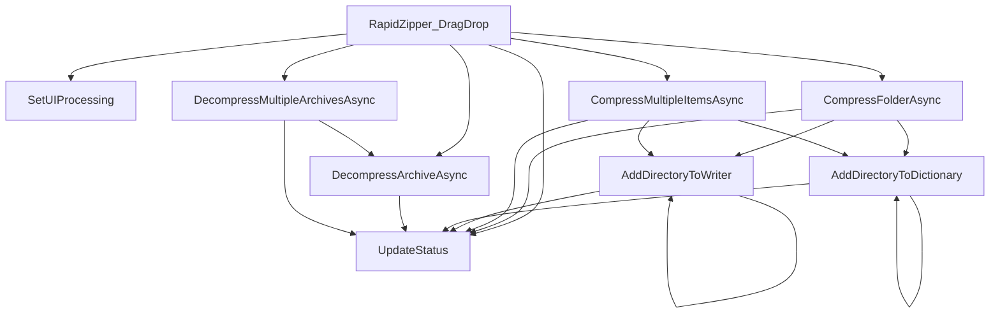

# [C#] Form1 (RapidZipper) 変数・関数仕様書

本ドキュメントは、[Form1.cs](file:///c:/Users/rikui/Documents/VSCode/%E3%83%A9%E3%83%94%E3%83%83%E3%83%89%E5%9C%A7%E7%B8%AE%E2%9C%A7%E5%B1%95%E9%96%8B/rapid-zipper/Form1.cs)におけるクラス、関数、および主要な変数の定義と依存関係を記述します。

## 1. クラス定義

### `RapidZipper` (行 14)
- **型**: `partial class` (継承: `Form`)
- **役割**: メインのWindows Formsアプリケーション画面のコントロールとロジックを保持する部分クラス。
  - **7z.dllのバグ回避策**: コンストラクタにて、実行環境（x64/x86）に合わせた `7z.dll` を特殊文字を含まない一時ディレクトリ（`Temp/RapidZipper_7z`）に上書きコピーした上でロードさせる。これにより親フォルダのパス名に含まれる Unicode 文字列（`✧` 等）に起因する `StringToAnsiString` マーシャリング例外（`unmappable character`）を回避している。

---

## 2. 関数定義

### `Form1_Load` (行 46)
- **型**: `private void`
- **役割**: フォームロード時の処理。

### `InitializeFormatComboBox` (行 50)
- **型**: `private void`
- **役割**: `FormatComboBox` の選択項目に "ZIP", "7Z", "TAR", "TGZ (tar.gz)" を追加し、デフォルト選択を "ZIP" に設定する。

### `RapidZipper_DragEnter` (行 60)
- **型**: `private void`
- **引数**:
  - `object sender`: イベント発生元
  - `DragEventArgs e`: ドラッグイベント引数
- **役割**: フォームまたはパネル上にデータがドラッグされた際、ファイル（FileDrop）であれば `DragDropEffects.Copy` を設定して受け入れ状態にする。

### `RapidZipper_DragDrop` (行 79)
- **型**: `private async void`
- **引数**:
  - `object sender`: イベント発生元
  - `DragEventArgs e`: ドロップイベント引数
- **役割**: ファイルがドロップされた際、アーカイブファイル（ZIP, 7z, RAR, TAR, GZ, TGZ）が含まれている場合は展開処理を実行。フォルダ1つなら `CompressFolderAsync` を、その他混在なら `CompressMultipleItemsAsync` を実行し、`FormatComboBox` の選択フォーマット（ZIP/7Z/TAR/TGZ）で圧縮アーカイブを作成する。
- **依存関係**: `IsArchiveFile`, `DecompressArchiveAsync`, `DecompressMultipleArchivesAsync`, `CompressFolderAsync`, `CompressMultipleItemsAsync`, `SetUIProcessing`

### `UpdateStatus` (行 260)
- **型**: `private void`
- **引数**:
  - `string message`: 表示するステータスメッセージ
- **役割**: `Statuslabel` コントロールのテキストを安全に（InvokeRequiredを考慮して）更新する。
- **影響範囲**: アプリケーション内の全ステータス表示更新

### `SetUIProcessing` (行 272)
- **型**: `private void`
- **引数**:
  - `bool isProcessing`: 処理中かどうかのフラグ
- **役割**: 処理中のプログレスバー表示の切り替え（Marqueeアニメーション開始/停止）および多重ドロップ防止のためのパネル活性制御を安全に（InvokeRequiredを考慮して）行う。
- **影響範囲**: `ProcessingBar`, `DragDropPanel`

### `CompressFolderAsync` (行 294)
- **型**: `private async Task`
- **引数**:
  - `string folderPath`: 圧縮対象フォルダの絶対パス
  - `string format`: 圧縮フォーマット ("ZIP" / "7Z" / "TAR" / "TGZ (tar.gz)")
- **役割**: 指定された単一フォルダを、指定フォーマットで同一階層内に圧縮・生成する（ZIPは `ZipFile`、7Zは `SevenZipCompressor`、その他は `SharpCompress` を使用）。
- **依存関係**: `AddDirectoryToDictionary`, `AddDirectoryToWriter`, `UpdateStatus`
- **影響範囲**: バックグラウンドスレッドでのIO・圧縮処理

### `CompressMultipleItemsAsync` (行 362)
- **型**: `private async Task`
- **引数**:
  - `string[] sourcePaths`: 圧縮対象ファイル・フォルダのパス配列
  - `string destZipPath`: 出力先圧縮ファイルの絶対パス
  - `string format`: 圧縮フォーマット ("ZIP" / "7Z" / "TAR" / "TGZ (tar.gz)")
- **役割**: 指定された複数のアイテムを1つのアーカイブファイルにまとめて非同期で圧縮する（7Zの場合は `SevenZipCompressor` を使用、その他は `SharpCompress` を使用）。
- **依存関係**: `AddDirectoryToDictionary`, `AddDirectoryToWriter`, `UpdateStatus`
- **影響範囲**: バックグラウンドスレッドでのIO・圧縮処理

### `AddDirectoryToDictionary` (行 435)
- **型**: `private void`
- **引数**:
  - `System.Collections.Generic.Dictionary<string, string> dict`: 圧縮対象ファイルの辞書（キー: アーカイブ内相対パス、値: ローカル絶対パス）
  - `string sourceRootDir`: 走査のルートディレクトリ
  - `string currentDir`: 現在走査中のディレクトリ
  - `string archivePathPrefix`: アーカイブ内でのフォルダ名プレフィックス
- **役割**: 指定されたフォルダ内の全ファイルおよびサブフォルダを再帰的に走査し、7Z圧縮用に対応辞書を構築する。
- **依存関係**: `UpdateStatus`, `AddDirectoryToDictionary`（自己再帰）

### `AddDirectoryToWriter` (行 459)
- **型**: `private void`
- **引数**:
  - `IWriter writer`: SharpCompressのアーカイブライター
  - `string sourceRootDir`: 圧縮元のベースディレクトリ
  - `string currentDir`: 現在走査中のサブディレクトリ
  - `string archivePathPrefix`: アーカイブ内でのフォルダ名プレフィックス
- **役割**: 指定されたフォルダ内の全ファイルおよびサブフォルダを再帰的（再帰呼び出し）に `IWriter` を用いてアーカイブに追加する。
- **依存関係**: `UpdateStatus`, `AddDirectoryToWriter`（自己再帰）

### `DecompressArchiveAsync` (行 483)
- **型**: `private async Task`
- **引数**:
  - `string archiveFilePath`: 展開対象アーカイブファイルの絶対パス
  - `string destParentDir`: 展開先親フォルダの絶対パス
- **役割**: 指定されたアーカイブファイルを非同期で展開する。
  - **自動フォーマット検出 (SharpCompress)**: `SharpCompress` ライブラリの `ArchiveFactory.Open` を用いて、ZIP/7z/RAR/TAR/GZ/TGZなどのフォーマットを自動検出して展開。
  - OSの標準コードページ (`CultureInfo.CurrentCulture.TextInfo.ANSICodePage`) を用いてエンコーディングを自動決定し、文字化けを防止。
  - 展開先フォルダが既に存在する場合は、ダイアログを介して「上書き」「別名保存」「キャンセル」を選択させる。
  - **高速上書き対応 (Move-and-Delete)**: 上書き選択時、既存フォルダの完全削除を待たずに、一瞬でユニークな一時フォルダ名に `Directory.Move` で退避させ、即座に展開処理を開始。退避したフォルダの実際の削除は別スレッドのバックグラウンド (`Task.Run`) で非同期に行うことで、上書き時の待ち時間をほぼゼロに短縮する。
- **依存関係**: `UpdateStatus`
- **影響範囲**: バックグラウンドスレッドでのIO・解凍処理

### `DecompressMultipleArchivesAsync` (行 596)
- **型**: `private async Task`
- **引数**:
  - `string[] archiveFilePaths`: 展開対象アーカイブファイルのパス配列
- **役割**: 複数の圧縮ファイルを順次連続展開するキューシステム。
  - 最初に1回だけ「共通の解凍先親フォルダ」を選んでもらうダイアログを表示。
  - 以降はバックグラウンドのループ（タスクキュー）で各ファイルを順番に `DecompressArchiveAsync` で解凍。
  - 進行状況を 「[1/3] 展開中: ファイル名...」 の形式で表示。
- **依存関係**: `DecompressArchiveAsync`, `UpdateStatus`

### `panel1_Paint` (行 702) / `label1_Click` (行 706) / `progressBar1_Click` (行 710) / `comboBox1_SelectedIndexChanged` (行 714)
- **型**: `private void`
- **役割**: デザイナーから自動登録されたイベントハンドラのプレースホルダー。

---

## 3. 依存関係マッピング (Dependency Mapping)

### 影響範囲 (Impact Scope)
- **`Program.cs`**: `Application.Run(new RapidZipper())` としてこのクラスを初期化・実行する。
- **`Form1.Designer.cs`**: `RapidZipper` クラスの部分クラス定義およびコントロール、イベントハンドラの関連付けを保持。
