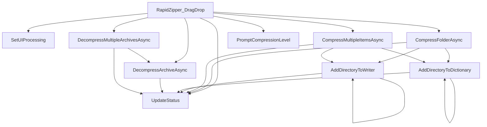

# [C#] Form1 (RapidZipper) 変数・関数仕様書

本ドキュメントは、[Form1.cs](file:///c:/Users/rikui/Documents/VSCode/%E3%83%A9%E3%83%94%E3%83%83%E3%83%89%E5%9C%A7%E7%B8%AE%E2%9C%A7%E5%B1%95%E9%96%8B/rapid-zipper/Form1.cs)におけるクラス、関数、および主要な変数の定義と依存関係を記述します。

## 1. クラス定義

### `RapidZipper` (行 14)
- **型**: `partial class` (継承: `Form`)
- **役割**: メイン of Windows Formsアプリケーション画面のコントロールとロジックを保持する部分クラス。
  - **7z.dllのバグ回避策 & 脆弱性対策 (VULN-001) & ポータブル化**: 
    コンストラクタにて、アセンブリ内に埋め込まれたリソース（`rapid_zipper.Resources.x64.7z.dll` または `rapid_zipper.Resources.x86.7z.dll`）から実行環境（x64/x86）に合わせた `7z.dll` をバイト配列として取得し、特殊文字を含まない一時ディレクトリ（`Temp/RapidZipper_7z_[GUID]`）に展開した上でロードさせる。
    これによって外部DLLファイルへの依存を完全に解消し、アプリケーション自体を単一の実行可能ファイル（シングルファイル）としてどこにでも配置・動作させることができる。
    一時フォルダ名に `Guid.NewGuid().ToString("N")` を使った予測不可能な文字列を組み込むことで、攻撃者が事前にフォルダリンクを作成してシステムファイルを不正に上書きさせるジャンクション攻撃（脆弱性 VULN-001）を完全に防いでいる。
    さらに、次回アプリ起動時に、過去のセッションで作成された古い `RapidZipper_7z_*` フォルダを走査して自動的に一掃するクリーンアップ処理を行う。

---

## 2. 関数定義

### `Form1_Load` (行 62)
- **型**: `private void`
- **役割**: フォームロード時の処理。

### `InitializeFormatComboBox` (行 66)
- **型**: `private void`
- **役割**: `FormatComboBox` の選択項目に "ZIP", "7Z", "TAR", "TGZ (tar.gz)" を追加し、デフォルト選択を "ZIP" に設定する。

### `RapidZipper_DragEnter` (行 76)
- **型**: `private void`
- **引数**:
  - `object sender`: イベント発生元
  - `DragEventArgs e`: ドラッグイベント引数
- **役割**: フォームまたはパネル上にデータがドラッグされた際、ファイル（FileDrop）であれば `DragDropEffects.Copy` を設定して受け入れ状態にする。

### `RapidZipper_DragDrop` (行 95)
- **型**: `private async void`
- **引数**:
  - `object sender`: イベント発生元
  - `DragEventArgs e`: ドロップイベント引数
- **役割**: ファイルがドロップされた際、アーカイブファイル（ZIP, 7z, RAR, TAR, GZ, TGZ）が含まれている場合は展開処理を実行。フォルダ1つなら `CompressFolderAsync` を、その他混在なら `CompressMultipleItemsAsync` を実行し、`FormatComboBox` の選択フォーマット（ZIP/7Z/TAR/TGZ）で圧縮アーカイブを作成する。
  - **レベル選択ダイアログの起動**: 7Z圧縮の場合は、圧縮開始直前に `PromptCompressionLevel` を呼び出してユーザーに圧縮レベルを「低・普通・高」から選択させ、その値を非同期の圧縮メソッドへ渡す。
- **依存関係**: `IsArchiveFile`, `DecompressArchiveAsync`, `DecompressMultipleArchivesAsync`, `CompressFolderAsync`, `CompressMultipleItemsAsync`, `SetUIProcessing`, `PromptCompressionLevel`

### `UpdateStatus` (行 300)
- **型**: `private void`
- **引数**:
  - `string message`: 表示するステータスメッセージ
- **役割**: `Statuslabel` コントロールのテキストを安全に（InvokeRequiredを考慮して）更新する。
- **影響範囲**: アプリケーション内の全ステータス表示更新

### `SetUIProcessing` (行 312)
- **型**: `private void`
- **引数**:
  - `bool isProcessing`: 処理中かどうかのフラグ
- **役割**: 処理中のプログレスバー表示の切り替え（Marqueeアニメーション開始/停止）および多重ドロップ防止のためのパネル活性制御を安全に（InvokeRequiredを考慮して）行う。
- **影響範囲**: `ProcessingBar`, `DragDropPanel`

### `CompressFolderAsync` (行 334)
- **型**: `private async Task`
- **引数**:
  - `string folderPath`: 圧縮対象フォルダの絶対パス
  - `string format`: 圧縮フォーマット ("ZIP" / "7Z" / "TAR" / "TGZ (tar.gz)")
  - `SevenZip.CompressionLevel sevenZipLevel`: 選択された7z圧縮レベル
- **役割**: 指定された単一フォルダを、指定フォーマットで同一階層内に圧縮・生成する（ZIPは `ZipFile`、7Zは `SevenZipCompressor`、その他は `SharpCompress` を使用）。
  - **7Zパフォーマンスパラメータ制御**: 選択された `sevenZipLevel`（低・普通・高）に応じて、辞書サイズ（4m / 8m / 32m）およびスレッド制限（Highのときはメモリ制限のため最大4スレッドに制限）を最適化して圧縮する。
  - 圧縮開始前のファイルリスト構築中は、「フォルダ内をスキャン中...」というステータスを表示するよう改善。
- **依存関係**: `AddDirectoryToDictionary`, `AddDirectoryToWriter`, `UpdateStatus`
- **影響範囲**: バックグラウンドスレッドでのIO・圧縮処理

### `CompressMultipleItemsAsync` (行 426)
- **型**: `private async Task`
- **引数**:
  - `string[] sourcePaths`: 圧縮対象ファイル・フォルダのパス配列
  - `string destZipPath`: 出力先圧縮ファイルの絶対パス
  - `string format`: 圧縮フォーマット ("ZIP" / "7Z" / "TAR" / "TGZ (tar.gz)")
  - `SevenZip.CompressionLevel sevenZipLevel`: 選択された7z圧縮レベル
- **役割**: 指定された複数のアイテムを1つのアーカイブファイルにまとめて非同期で圧縮する（7Zの場合は `SevenZipCompressor` を使用、その他は `SharpCompress` を使用）。
  - **7Zパフォーマンスパラメータ制御**: 単一フォルダ圧縮と同様に、選択された `sevenZipLevel` に応じた辞書サイズ・スレッド数の制限パラメータを適用し、メモリ消費量と処理速度の最適化を行っている。
  - 圧縮開始前のファイルリスト構築中は、「ファイル・フォルダをスキャン中...」というステータスを表示するよう改善。
- **依存関係**: `AddDirectoryToDictionary`, `AddDirectoryToWriter`, `UpdateStatus`
- **影響範囲**: バックグラウンドスレッドでのIO・圧縮処理

### `PromptCompressionLevel` (行 486)
- **型**: `private SevenZip.CompressionLevel`
- **役割**: 7z圧縮を行う直前に、動的な選択ダイアログ（Form）を画面中央に生成・表示し、ラジオボタンによって「低」「普通」「高」のいずれかを選択させる。
- **戻り値**: 選択された `CompressionLevel`（Low / Normal / High）

### `ConfigureSevenZipCompressor` (行 530)
- **型**: `private SevenZipCompressor`
- **引数**:
  - `SevenZip.CompressionLevel level`: 設定する圧縮レベル
- **役割**: 7z圧縮レベルに応じた辞書サイズ（4m/8m/32m）およびスレッド制限のパラメータを `SevenZipCompressor` に対して設定する共通共通ヘルパー。
- **影響範囲**: `CompressFolderAsync`, `CompressMultipleItemsAsync`

### `IsProtectedDirectory` (行 560)
- **型**: `private bool`
- **引数**:
  - `string path`: 検査対象のフォルダ絶対パス
- **役割**: 指定されたパスが、重要なシステムフォルダ（デスクトップ、ドキュメント、ユーザープロファイル、Windows等）やドライブのルートディレクトリであるかを検証し、削除・上書きを防止するための保護判定を行う。
- **戻り値**: 保護対象パスであれば `true`、それ以外なら `false`
- **影響範囲**: `DecompressArchiveAsync`

### `AddDirectoryToDictionary` (行 616)
- **型**: `private void`
- **引数**:
  - `System.Collections.Generic.Dictionary<string, string> dict`: 圧縮対象ファイルの辞書（キー: アーカイブ内相対パス、値: ローカル絶対パス）
  - `string sourceRootDir`: 走査のルートディレクトリ
  - `string currentDir`: 現在走査中のディレクトリ
  - `string archivePathPrefix`: アーカイブ内でのフォルダ名プレフィックス
- **役割**: 指定されたフォルダ内の全ファイルおよびサブフォルダを再帰的に走査し、7Z圧縮用に対応辞書を構築する。
- **依存関係**: `UpdateStatus`, `AddDirectoryToDictionary`（自己再帰）

### `AddDirectoryToWriter` (行 591)
- **型**: `private void`
- **引数**:
  - `IWriter writer`: SharpCompressのアーカイブライター
  - `string sourceRootDir`: 圧縮元のベースディレクトリ
  - `string currentDir`: 現在走査中のサブディレクトリ
  - `string archivePathPrefix`: アーカイブ内でのフォルダ名プレフィックス
- **役割**: 指定されたフォルダ内の全ファイルおよびサブフォルダを再帰的（再帰呼び出し）に `IWriter` を用いてアーカイブに追加する。
- **依存関係**: `UpdateStatus`, `AddDirectoryToWriter`（自己再帰）

### `DecompressArchiveAsync` (行 686)
- **型**: `private async Task`
- **引数**:
  - `string archiveFilePath`: 展開対象アーカイブファイルの絶対パス
- **string destParentDir**: 展開先親フォルダの絶対パス
- **役割**: 指定されたアーカイブファイルを安全かつ非同期で展開する。
  - **システムディレクトリ保護**: 展開先が `IsProtectedDirectory` で保護対象と判定された場合は、処理を中断してエラーダイアログを表示する。
  - **安全リプレース（成功後置換）**: 上書き展開時、既存フォルダの即時削除はせず、まずユニークな一時フォルダ（`_temp_[GUID]`）に解凍する。展開がすべて**正常に成功した後に初めて**、既存フォルダを `_backup_[GUID]` に退避し、一時フォルダを正式名に変更した上でバックアップを非同期（`Task.Run`）で完全削除する。解凍エラー発生時は一時フォルダのみをクリーンアップし、元のフォルダは無傷で保護される（ロールバック安全策）。
  - **Zip Slip（Path Traversal）防止**: 各エントリの展開先フルパスを `Path.GetFullPath` で正規化し、それが展開先フォルダの配下（`StartsWith`）にあるかを厳密に検証することで、解凍先フォルダ外へのファイルの不正な書き出しをブロックする。
  - **Zip Bomb（容量・ファイル数）制限**: 解凍前にアーカイブのヘッダー情報を読み取り、解凍後合計サイズ（上限10GB）およびファイル数（上限5万）を事前確認し、超えている場合は例外を投げて処理を中断する。また、展開ループ中も実際に書き出したバイト数を監視し、上限を超えたら即時中断・ロールバックする二重の防御を持つ。
  - **自動最適化ルート分岐による超高速化**:
    1. **`.zip`形式**: .NET標準の `ZipArchive` を用いて、Zip Slip防止と容量チェックを行いながら展開。
    2. **`.7z`形式**: `SevenZipExtractor` を使用。事前にパス検証を行った上でネイティブロード。
    3. **その他の形式**: `SharpCompress` の `IReader` を使用。事前サイズチェックを行った上で、各エントリごとにパス検証を適用してシーケンシャル展開。
- **依存関係**: `UpdateStatus`, `IsProtectedDirectory`
- **影響範囲**: バックグラウンドスレッドでのIO・解凍処理

### `DecompressMultipleArchivesAsync` (行 748)
- **型**: `private async Task`
- **引数**:
  - `string[] archiveFilePaths`: 展開対象アーカイブファイルのパス配列
- **役割**: 複数の圧縮ファイルを順次連続展開するキューシステム。
  - 最初に1回だけ「共通の解凍先親フォルダ」を選んでもらうダイアログを表示。
  - 以降はバックグラウンドのループ（タスクキュー）で各ファイルを順番に `DecompressArchiveAsync` で解凍。
  - 進行状況を 「[1/3] 展開中: ファイル名...」 の形式で表示。
- **依存関係**: `DecompressArchiveAsync`, `UpdateStatus`

---

## 3. 依存関係マッピング (Dependency Mapping)

### 影響範囲 (Impact Scope)
- **`Program.cs`**: `Application.Run(new RapidZipper())` としてこのクラスを初期化・実行する。
- **`Form1.Designer.cs`**: `RapidZipper` クラスの部分クラス定義およびコントロール、イベントハンドラの関連付けを保持。
