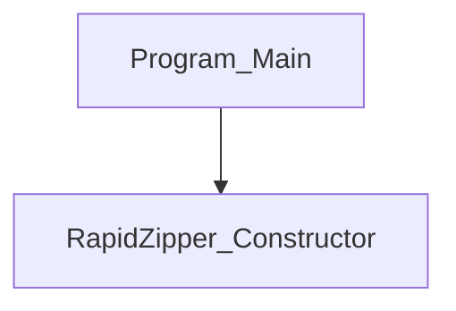

# [C#] Program (RapidZipper) 変数・関数仕様書

本ドキュメントは、[Program.cs](file:///c:/Users/rikui/Documents/VSCode/%E3%83%A9%E3%83%94%E3%83%83%E3%83%89%E5%9C%A7%E7%B8%AE%E2%9C%A7%E5%B1%95%E9%96%8B/rapid-zipper/Program.cs)におけるクラス、関数、および引数の定義と依存関係を記述します。

## 1. クラス定義

### `Program` (行 3)
- **型**: `internal static class`
- **役割**: Windows Forms アプリケーションのエントリーポイントを内包する静的クラス。

---

## 2. 関数定義

### `Main` (行 9)
- **型**: `static void` (属性: `[STAThread]`)
- **引数**:
  - `string[] args`: コマンドラインから引き渡された起動引数。エクスプローラーの右クリックコンテキストメニューから起動された場合、その対象パスが格納される。
- **役割**: アプリケーションのメインエントリーポイント。
  1. `CodePagesEncodingProvider` を登録し、Shift_JIS などの日本語エンコードが .NET 10.0 上で正常に扱えるように初期化する。
  2. DPI 設定やデフォルトフォントなどのアプリケーション構成を初期化する。
  3. `args` を `RapidZipper` のコンストラクタに引き渡し、メインウィンドウを起動する。
- **依存関係**: `RapidZipper` コンストラクタ

---

## 3. 依存関係マッピング (Dependency Mapping)

### 影響範囲 (Impact Scope)
- **`Form1.cs`**: `args` を受け取り、Shown イベント時に処理を実行するコンストラクタが定義されている。
