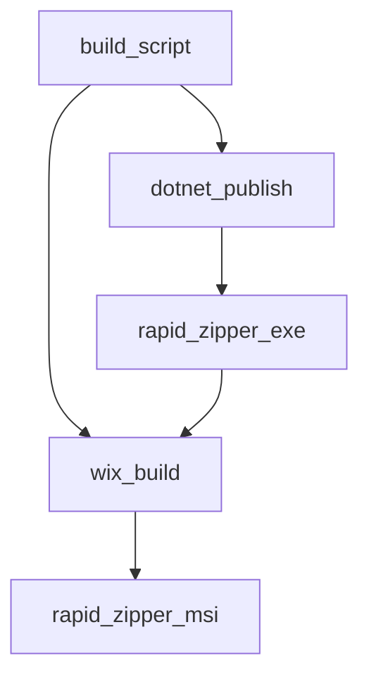

# [PowerShell] build-installer 変数・関数仕様書

本ドキュメントは、[build-installer.ps1](file:///c:/Users/rikui/Documents/VSCode/%E3%83%A9%E3%83%94%E3%83%83%E3%83%89%E5%9C%A7%E7%B8%AE%E2%9C%A7%E5%B1%95%E9%96%8B/rapid-zipper/build-installer.ps1)におけるステップ定義と使用される主要な変数の役割を記述します。

## 1. 概要
アプリケーション本体のシングルファイルパブリッシュ（`dotnet publish`）と、WiX Toolset v5 によるセットアップウィザード付き MSI パッケージのコンパイル（`wix build`）を順次実行し、エラーチェックを自動で行う一括ビルド自動化スクリプトです。

---

## 2. 変数定義

### `$ErrorActionPreference` (行 1)
- **型**: `string`
- **値**: `"Stop"`
- **役割**: スクリプト実行中にエラーが発生した場合、直ちにスクリプトの実行を停止（例外スロー）する PowerShell 共通変数。

### `$ScriptDir` (行 3)
- **型**: `string`
- **値**: `Split-Path -Parent $MyInvocation.MyCommand.Definition`
- **役割**: 現在実行されている `build-installer.ps1` ファイル自体の存在する親ディレクトリの絶対パス。
- **動作**: 取得に成功した場合、カレントディレクトリをスクリプトの場所へ自動的に変更（`Set-Location`）し、相対パス参照が常に正しく解決されるようにする。

### `$DestDir` (行 13)
- **型**: `string`
- **値**: `"bin\x64\Release"`
- **役割**: MSI インストーラーを出力するディレクトリの相対パス。
- **動作**: フォルダが存在しない場合、`New-Item -ItemType Directory` によって動的にディレクトリを新規作成する。

### `$MsiPath` (行 23)
- **型**: `string`
- **値**: `Resolve-Path "$DestDir\rapid-zipper.msi"`
- **役割**: 生成されたインストーラー `rapid-zipper.msi` の最終的な絶対パス。

---

## 3. 主要実行ステップ

### Step 1: `dotnet publish` (行 9)
- **動作**: `rapid-zipper.csproj` を Release ビルドでシングルファイル構成にて発行する。
- **パラメータ説明**:
  - `-c Release`: リリース構成でビルドする。
  - `-r win-x64`: Windows 64bit をターゲットプラットフォームにする。
  - `--self-contained true`: ターゲット環境に .NET ランタイムがなくても動くようにランタイムを内包する。
  - `-p:PublishSingleFile=true`: アプリケーションを単一の実行可能ファイル（exe）に統合する。
  - `-p:PublishReadyToRun=false`: ビルド速度を最適化するために ReadyToRun（事前コンパイル）をオフにする。
  - `-p:IncludeNativeLibrariesForSelfExtract=true`: 依存するネイティブライブラリを自己展開用に含める。
- **例外制御**: コマンド終了ステータス `$LASTEXITCODE` が `0` でない場合は、`throw` して中断する。

### Step 2: `wix build` (行 19)
- **動作**: `Product.wxs` をソースとして、インストーラー（MSI）をコンパイル・リンクする。
- **パラメータ説明**:
  - `-arch x64`: アーキテクチャを x64 に指定する。
  - `-culture ja-JP`: WixUI の文言やメッセージを日本語ローカライズ版でビルドする。
  - `-ext WixToolset.UI.wixext`: セットアップウィザード画面用の WiX 拡張をロードする。
  - `-ext WixToolset.Util.wixext`: インストール完了時のアプリ起動（WixShellExec）などのユーティリティアクションを有効化する。
  - `-o "$DestDir\rapid-zipper.msi"`: 指定した出力パスに msi を出力する。
- **例外制御**: `$LASTEXITCODE` が `0` でない場合は、`throw` して中断する。

---

## 4. 依存関係マッピング (Dependency Mapping)

