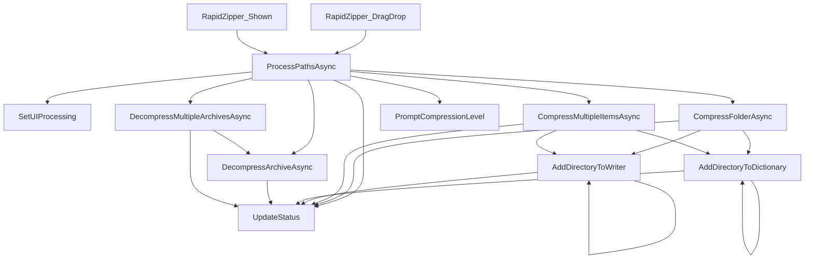
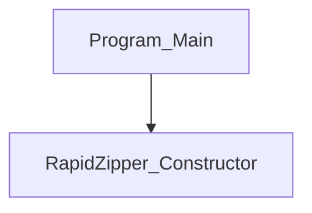
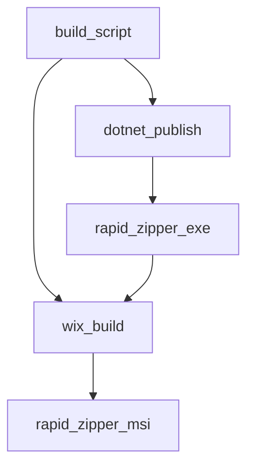

# ラピッド圧縮✧展開/RapidZipperまとめ

特に意味もなく毎回作ってるまとめだよ。

- **GitHubリポジトリ:** [https://github.com/DovahkiinYuzuko/rapid-zipper](https://github.com/DovahkiinYuzuko/rapid-zipper)
- GitHubアクションでmsiのビルドは自動化済みだよ。

## 目次

- [ラピッド圧縮✧展開/RapidZipperまとめ](#ラピッド圧縮展開rapidzipperまとめ)
  - [目次](#目次)
  - [ディレクトリ構成](#ディレクトリ構成)
  - [ソースコード](#ソースコード)
    - [ラピッド圧縮✧展開/rapid-zipper/](#ラピッド圧縮展開rapid-zipper)
      - [Form1.cs](#form1cs)
      - [Form1.Designer.cs](#form1designercs)
      - [Program.cs](#programcs)
      - [build-installer.ps1](#build-installerps1)
  - [設定ファイル](#設定ファイル)
    - [ラピッド圧縮✧展開/rapid-zipper/](#ラピッド圧縮展開rapid-zipper-1)
      - [Form1.bgc.resx](#form1bgcresx)
      - [Form1.resx](#form1resx)
      - [Product.wxs](#productwxs)
      - [rapid-zipper.csproj.user](#rapid-zippercsprojuser)
      - [rapid-zipper.csproj](#rapid-zippercsproj)
      - [rapid-zipper.slnx](#rapid-zipperslnx)
      - [rapid-zipper.wixproj](#rapid-zipperwixproj)
    - [ラピッド圧縮✧展開/.github/workflows](#ラピッド圧縮展開githubworkflows)
      - [release.yml](#releaseyml)
  - [ドキュメント類](#ドキュメント類)
    - [ラピッド圧縮✧展開/](#ラピッド圧縮展開)
      - [.gitignore](#gitignore)
      - [LICENSE](#license)
      - [NOTICE.md](#noticemd)
      - [README.md](#readmemd)
    - [ラピッド圧縮✧展開/docs/variables'n'functions](#ラピッド圧縮展開docsvariablesnfunctions)
      - [\[C#\]Form1.md](#cform1md)
      - [\[C#\]Program.md](#cprogrammd)
      - [\[PowerShell\]build-installer.md](#powershellbuild-installermd)

## ディレクトリ構成
```txt
.
├── .github/
│   └── workflows/
│       └── release.yml
├── docs/
│   └── variables'n'functions/
│       ├── [C#]Form1.md
│       ├── [C#]Program.md
│       └── [PowerShell]build-installer.md
├── rapid-zipper/
│   ├── Form1.cs
│   ├── Form1.Designer.cs
│   ├── Form1.resx
│   ├── Form1.bgc.resx
│   ├── Program.cs
│   ├── Product.wxs
│   ├── License.rtf
│   ├── build-installer.ps1
│   ├── rapid-zipper.csproj
│   ├── rapid-zipper.csproj.user
│   ├── rapid-zipper.slnx
│   └── rapid-zipper.wixproj
├── .gitignore
├── LICENSE
├── NOTICE.md
└── README.md

```

## ソースコード

### ラピッド圧縮✧展開/rapid-zipper/
#### Form1.cs
```csharp
using System;
using System.IO;
using System.IO.Compression;
using System.Threading.Tasks;
using System.Windows.Forms;
using SharpCompress.Archives;
using SharpCompress.Common;
using SharpCompress.Readers;
using SharpCompress.Writers;
using SevenZip;

namespace rapid_zipper
{
    public partial class RapidZipper : Form
    {
        private string[]? _startupArgs;

        public RapidZipper(string[]? args = null)
        {
            InitializeComponent();
            InitializeFormatComboBox();
            _startupArgs = args;

            try
            {
                // 1. 前回の実行で作成された古い一時フォルダ (RapidZipper_7z_*) を自動クリーンアップ
                string tempParent = Path.GetTempPath();
                foreach (var dir in Directory.GetDirectories(tempParent, "RapidZipper_7z_*"))
                {
                    try
                    {
                        Directory.Delete(dir, true);
                    }
                    catch
                    {
                        // 使用中（他のインスタンス実行中）などの場合は握りつぶす
                    }
                }

                // 2. 埋め込みリソースから 7z.dll を Unicode を含まない Temp フォルダに展開してロード
                // (SevenZipSharpのUnicodeパスバグ回避策 & ポータブルなシングルファイル化 & VULN-001のDLL上書き脆弱性防止)
                string resourceName = Environment.Is64BitProcess 
                    ? "rapid_zipper.Resources.x64.7z.dll" 
                    : "rapid_zipper.Resources.x86.7z.dll";

                var assembly = System.Reflection.Assembly.GetExecutingAssembly();
                using (Stream? resourceStream = assembly.GetManifestResourceStream(resourceName))
                {
                    if (resourceStream != null)
                    {
                        string randomFolderName = "RapidZipper_7z_" + Guid.NewGuid().ToString("N");
                        string tempDir = Path.Combine(tempParent, randomFolderName, Environment.Is64BitProcess ? "x64" : "x86");
                        Directory.CreateDirectory(tempDir);
                        string destDllPath = Path.Combine(tempDir, "7z.dll");

                        // 埋め込みリソースのデータを一時ファイルに書き出す
                        using (FileStream fileStream = new FileStream(destDllPath, FileMode.Create, FileAccess.Write))
                        {
                            resourceStream.CopyTo(fileStream);
                        }

                        SevenZipBase.SetLibraryPath(destDllPath);
                    }
                    else
                    {
                        System.Diagnostics.Debug.WriteLine($"警告: 埋め込みリソース {resourceName} が見つかりません。");
                    }
                }
            }
            catch (Exception ex)
            {
                System.Diagnostics.Debug.WriteLine($"7z.dllロードエラー: {ex.Message}");
            }
        }

        private void Form1_Load(object sender, EventArgs e)
        {
        }

        private void InitializeFormatComboBox()
        {
            FormatComboBox.Items.Clear();
            FormatComboBox.Items.Add("ZIP");
            FormatComboBox.Items.Add("7Z");
            FormatComboBox.Items.Add("TAR");
            FormatComboBox.Items.Add("TGZ (tar.gz)");
            FormatComboBox.SelectedIndex = 0;
        }

        private void RapidZipper_DragEnter(object sender, DragEventArgs e)
        {
            if (e.Data != null && e.Data.GetDataPresent(DataFormats.FileDrop))
            {
                e.Effect = DragDropEffects.Copy;
            }
            else
            {
                e.Effect = DragDropEffects.None;
            }
        }

        private bool IsArchiveFile(string path)
        {
            if (!File.Exists(path)) return false;
            string ext = Path.GetExtension(path).ToLower();
            return ext == ".zip" || ext == ".7z" || ext == ".rar" || ext == ".tar" || ext == ".gz" || ext == ".tgz";
        }

        private async void RapidZipper_DragDrop(object sender, DragEventArgs e)
        {
            if (e.Data == null || !e.Data.GetDataPresent(DataFormats.FileDrop)) return;

            var paths = (string[]?)e.Data.GetData(DataFormats.FileDrop);
            if (paths == null || paths.Length == 0) return;

            try
            {
                SetUIProcessing(true);
                await ProcessPathsAsync(paths);
            }
            catch (Exception ex)
            {
                UpdateStatus($"Error occurred: {ex.Message} / エラーが発生しました: {ex.Message}");
            }
            finally
            {
                SetUIProcessing(false);
            }
        }

        private async void RapidZipper_Shown(object sender, EventArgs e)
        {
            if (_startupArgs != null && _startupArgs.Length > 0)
            {
                try
                {
                    SetUIProcessing(true);
                    await ProcessPathsAsync(_startupArgs);
                }
                catch (Exception ex)
                {
                    MessageBox.Show(
                        $"Error occurred: {ex.Message} / エラーが発生しました: {ex.Message}",
                        "Error / エラー",
                        MessageBoxButtons.OK,
                        MessageBoxIcon.Error
                    );
                }
                finally
                {
                    SetUIProcessing(false);
                    // 起動引数で動かした場合は、処理後に自動でアプリを閉じる
                    Application.Exit();
                }
            }
        }

        private async Task ProcessPathsAsync(string[] paths)
        {
            // ドロップされたファイルからアーカイブファイルのみを抽出
            var archiveFiles = new System.Collections.Generic.List<string>();
            foreach (var path in paths)
            {
                if (IsArchiveFile(path))
                {
                    archiveFiles.Add(path);
                }
            }

            // 選択された圧縮形式を取得
            string selectedFormat = "ZIP";
            if (InvokeRequired)
            {
                Invoke(new Action(() => selectedFormat = FormatComboBox.SelectedItem?.ToString() ?? "ZIP"));
            }
            else
            {
                selectedFormat = FormatComboBox.SelectedItem?.ToString() ?? "ZIP";
            }

            // 1. アーカイブファイルの展開処理
            if (archiveFiles.Count > 0 && archiveFiles.Count == paths.Length)
            {
                if (archiveFiles.Count == 1)
                {
                    // 1つのアーカイブファイルを展開
                    string firstFileDir = Path.GetDirectoryName(archiveFiles[0]) ?? string.Empty;
                    string selectedParentDir = string.Empty;

                    if (InvokeRequired)
                    {
                        Invoke(new Action(() =>
                        {
                            using (var dialog = new FolderBrowserDialog())
                            {
                                dialog.Description = "Select destination folder / 解凍先フォルダを選択してください";
                                dialog.InitialDirectory = firstFileDir;
                                dialog.SelectedPath = firstFileDir;
                                if (dialog.ShowDialog() == DialogResult.OK)
                                {
                                    selectedParentDir = dialog.SelectedPath;
                                }
                            }
                        }));
                    }
                    else
                    {
                        using (var dialog = new FolderBrowserDialog())
                        {
                            dialog.Description = "Select destination folder / 解凍先フォルダを選択してください";
                            dialog.InitialDirectory = firstFileDir;
                            dialog.SelectedPath = firstFileDir;
                            if (dialog.ShowDialog() == DialogResult.OK)
                            {
                                selectedParentDir = dialog.SelectedPath;
                            }
                        }
                    }

                    if (!string.IsNullOrEmpty(selectedParentDir))
                    {
                        await DecompressArchiveAsync(archiveFiles[0], selectedParentDir);

                        DialogResult openFolderResult = MessageBox.Show(
                            "Extraction completed. Open the folder?\r\n展開が完了しました。フォルダを開きますか？",
                            "Completed / 完了",
                            MessageBoxButtons.YesNo,
                            MessageBoxIcon.Question
                        );

                        if (openFolderResult == DialogResult.Yes)
                        {
                            string archiveNameWithoutExt = Path.GetFileNameWithoutExtension(archiveFiles[0]);
                            string destDir = Path.Combine(selectedParentDir, archiveNameWithoutExt);
                            System.Diagnostics.Process.Start(new System.Diagnostics.ProcessStartInfo()
                            {
                                FileName = Directory.Exists(destDir) ? destDir : selectedParentDir,
                                UseShellExecute = true
                            });
                        }
                    }
                    else
                    {
                        UpdateStatus("Extraction cancelled. / 展開処理をキャンセルしました。");
                    }
                }
                else
                {
                    // 複数のアーカイブファイルを順次展開
                    await DecompressMultipleArchivesAsync(archiveFiles.ToArray());
                }
            }
            // 2. 単一のフォルダがドロップされた場合（自動圧縮）
            else if (paths.Length == 1 && Directory.Exists(paths[0]))
            {
                SevenZip.CompressionLevel sevenZipLevel = SevenZip.CompressionLevel.Normal;
                if (selectedFormat == "7Z")
                {
                    if (InvokeRequired)
                    {
                        Invoke(new Action(() => sevenZipLevel = PromptCompressionLevel()));
                    }
                    else
                    {
                        sevenZipLevel = PromptCompressionLevel();
                    }
                }
                await CompressFolderAsync(paths[0], selectedFormat, sevenZipLevel);
            }
            // 3. それ以外（複数アイテムを1つのアーカイブに圧縮）
            else
            {
                string defaultDir = Path.GetDirectoryName(paths[0]) ?? string.Empty;

                string ext = ".zip";
                if (selectedFormat == "TAR") ext = ".tar";
                else if (selectedFormat.StartsWith("TGZ")) ext = ".tar.gz";
                else if (selectedFormat == "7Z") ext = ".7z";

                string defaultZipName = "archive" + ext;
                if (paths.Length == 1)
                {
                    defaultZipName = Path.GetFileNameWithoutExtension(paths[0]) + ext;
                }

                string destZipPath = string.Empty;

                if (InvokeRequired)
                {
                    Invoke(new Action(() =>
                    {
                        using (var sfd = new SaveFileDialog())
                        {
                            sfd.Filter = $"Compressed File (*{ext})|*{ext}";
                            sfd.InitialDirectory = defaultDir;
                            sfd.FileName = defaultZipName;
                            sfd.Title = "Select save destination for compressed file / 圧縮ファイルの保存先を選択してください";

                            if (sfd.ShowDialog() == DialogResult.OK)
                            {
                                destZipPath = sfd.FileName;
                            }
                        }
                    }));
                }
                else
                {
                    using (var sfd = new SaveFileDialog())
                    {
                        sfd.Filter = $"Compressed File (*{ext})|*{ext}";
                        sfd.InitialDirectory = defaultDir;
                        sfd.FileName = defaultZipName;
                        sfd.Title = "Select save destination for compressed file / 圧縮ファイルの保存先を選択してください";

                        if (sfd.ShowDialog() == DialogResult.OK)
                        {
                            destZipPath = sfd.FileName;
                        }
                    }
                }

                if (!string.IsNullOrEmpty(destZipPath))
                {
                    SevenZip.CompressionLevel sevenZipLevel = SevenZip.CompressionLevel.Normal;
                    if (selectedFormat == "7Z")
                    {
                        if (InvokeRequired)
                        {
                            Invoke(new Action(() => sevenZipLevel = PromptCompressionLevel()));
                        }
                        else
                        {
                            sevenZipLevel = PromptCompressionLevel();
                        }
                    }
                    await CompressMultipleItemsAsync(paths, destZipPath, selectedFormat, sevenZipLevel);
                }
                else
                {
                    UpdateStatus("Compression cancelled. / 圧縮処理をキャンセルしました。");
                }
            }
        }

        private void UpdateStatus(string message)
        {
            if (Statuslabel.InvokeRequired)
            {
                Statuslabel.Invoke(new Action(() => UpdateStatus(message)));
            }
            else
            {
                Statuslabel.Text = message;
            }
        }

        private void SetUIProcessing(bool isProcessing)
        {
            if (InvokeRequired)
            {
                Invoke(new Action(() => SetUIProcessing(isProcessing)));
                return;
            }

            if (isProcessing)
            {
                ProcessingBar.Style = ProgressBarStyle.Marquee;
                ProcessingBar.MarqueeAnimationSpeed = 30;
                DragDropPanel.Enabled = false;
            }
            else
            {
                ProcessingBar.Style = ProgressBarStyle.Blocks;
                ProcessingBar.Value = 0;
                DragDropPanel.Enabled = true;
            }
        }

        private async Task CompressFolderAsync(string folderPath, string format, SevenZip.CompressionLevel sevenZipLevel = SevenZip.CompressionLevel.Normal)
        {
            string parentDir = Path.GetDirectoryName(folderPath) ?? string.Empty;
            string folderName = Path.GetFileName(folderPath);

            string ext = ".zip";
            ArchiveType archiveType = ArchiveType.Zip;

            if (format == "TAR")
            {
                ext = ".tar";
                archiveType = ArchiveType.Tar;
            }
            else if (format.StartsWith("TGZ"))
            {
                ext = ".tar.gz";
                archiveType = ArchiveType.Tar;
            }
            else if (format == "7Z")
            {
                ext = ".7z";
            }

            string destZipPath = Path.Combine(parentDir, folderName + ext);
            UpdateStatus($"Compressing: {folderName}{ext} / 圧縮中");

            await Task.Run(() =>
            {
                if (File.Exists(destZipPath))
                {
                    File.Delete(destZipPath);
                }

                if (format == "ZIP")
                {
                    ZipFile.CreateFromDirectory(folderPath, destZipPath, System.IO.Compression.CompressionLevel.Fastest, includeBaseDirectory: false);
                }
                else if (format == "7Z")
                {
                    UpdateStatus("Scanning folder... / フォルダ内をスキャン中...");
                    var filesToCompress = new System.Collections.Generic.Dictionary<string, string>();
                    AddDirectoryToDictionary(filesToCompress, folderPath, folderPath, string.Empty);

                    UpdateStatus("7z compressing... / 7z圧縮中...");
                    var compressor = ConfigureSevenZipCompressor(sevenZipLevel);
                    compressor.CompressFileDictionary(filesToCompress, destZipPath);
                }
                else
                {
                    using (var fs = File.OpenWrite(destZipPath))
                    {
                        var writerOptions = new WriterOptions(CompressionType.None);
                        if (format.StartsWith("TGZ"))
                        {
                            writerOptions = new WriterOptions(CompressionType.GZip);
                        }

                        using (var writer = WriterFactory.OpenWriter(fs, archiveType, writerOptions))
                        {
                            AddDirectoryToWriter(writer, folderPath, folderPath, string.Empty);
                        }
                    }
                }
            });

            UpdateStatus("Compression completed. / 圧縮が完了しました。");
        }

        private async Task CompressMultipleItemsAsync(string[] sourcePaths, string destZipPath, string format, SevenZip.CompressionLevel sevenZipLevel = SevenZip.CompressionLevel.Normal)
        {
            UpdateStatus("Preparing compression... / 圧縮処理を準備中...");

            ArchiveType archiveType = ArchiveType.Zip;
            CompressionType compressionType = CompressionType.Deflate;

            if (format == "TAR")
            {
                archiveType = ArchiveType.Tar;
                compressionType = CompressionType.None;
            }
            else if (format.StartsWith("TGZ"))
            {
                archiveType = ArchiveType.Tar;
                compressionType = CompressionType.GZip;
            }

            await Task.Run(() =>
            {
                if (File.Exists(destZipPath))
                {
                    File.Delete(destZipPath);
                }

                if (format == "7Z")
                {
                    UpdateStatus("Scanning files/folders... / ファイル・フォルダをスキャン中...");
                    var filesToCompress = new System.Collections.Generic.Dictionary<string, string>();
                    foreach (var path in sourcePaths)
                    {
                        if (Directory.Exists(path))
                        {
                            AddDirectoryToDictionary(filesToCompress, path, path, Path.GetFileName(path));
                        }
                        else if (File.Exists(path))
                        {
                            string entryName = Path.GetFileName(path);
                            filesToCompress[entryName] = path;
                        }
                    }

                    UpdateStatus("7z compressing... / 7z圧縮中...");
                    var compressor = ConfigureSevenZipCompressor(sevenZipLevel);
                    compressor.CompressFileDictionary(filesToCompress, destZipPath);
                }
                else
                {
                    using (var fs = File.OpenWrite(destZipPath))
                    {
                        using (var writer = WriterFactory.OpenWriter(fs, archiveType, new WriterOptions(compressionType)))
                        {
                            foreach (var path in sourcePaths)
                            {
                                if (Directory.Exists(path))
                                {
                                    AddDirectoryToWriter(writer, path, path, Path.GetFileName(path));
                                }
                                else if (File.Exists(path))
                                {
                                    string entryName = Path.GetFileName(path);
                                    UpdateStatus($"Compressing: {entryName} / 圧縮中: {entryName}");
                                    writer.Write(entryName, path);
                                }
                            }
                        }
                    }
                }
            });

            UpdateStatus("Compression completed. / 圧縮が完了しました。");
        }

        private SevenZip.CompressionLevel PromptCompressionLevel()
        {
            using (var prompt = new Form())
            {
                prompt.Width = 400;
                prompt.Height = 230;
                prompt.Text = "Select 7z Compression Level / 7z 圧縮レベルの選択";
                prompt.FormBorderStyle = FormBorderStyle.FixedDialog;
                prompt.StartPosition = FormStartPosition.CenterParent;
                prompt.MaximizeBox = false;
                prompt.MinimizeBox = false;

                var label = new Label()
                {
                    Left = 20,
                    Top = 15,
                    Width = 360,
                    Height = 50,
                    Text = "Select 7z compression level / 7zの圧縮レベルを選択してください\r\n(Higher level is more compressed but takes more memory and time)"
                };

                var radioLow = new RadioButton() { Left = 30, Top = 70, Width = 340, Text = "Low / 低 (Fast / High Speed - Dictionary 4MB)", Checked = false };
                var radioNormal = new RadioButton() { Left = 30, Top = 95, Width = 340, Text = "Normal / 普通 (Balanced - Dictionary 8MB)", Checked = true };
                var radioHigh = new RadioButton() { Left = 30, Top = 120, Width = 340, Text = "High / 高 (High Compression - Dictionary 32MB)", Checked = false };

                var buttonOk = new Button() { Text = "OK / 決定", Left = 280, Top = 155, Width = 80, DialogResult = DialogResult.OK };

                prompt.Controls.Add(label);
                prompt.Controls.Add(radioLow);
                prompt.Controls.Add(radioNormal);
                prompt.Controls.Add(radioHigh);
                prompt.Controls.Add(buttonOk);
                prompt.AcceptButton = buttonOk;

                buttonOk.Click += (sender, e) => { prompt.Close(); };

                prompt.ShowDialog();

                if (radioLow.Checked) return SevenZip.CompressionLevel.Low;
                if (radioHigh.Checked) return SevenZip.CompressionLevel.High;
                return SevenZip.CompressionLevel.Normal;
            }
        }

        private SevenZipCompressor ConfigureSevenZipCompressor(SevenZip.CompressionLevel level)
        {
            var compressor = new SevenZipCompressor();
            compressor.ArchiveFormat = OutArchiveFormat.SevenZip;
            compressor.CompressionLevel = level;
            compressor.CompressionMethod = CompressionMethod.Lzma2;
            compressor.FastCompression = true;

            int maxThreads = Math.Max(2, Environment.ProcessorCount / 2);
            string dictSize = "8m";

            if (level == SevenZip.CompressionLevel.Low)
            {
                dictSize = "4m";
            }
            else if (level == SevenZip.CompressionLevel.High)
            {
                dictSize = "32m";
                maxThreads = Math.Min(4, maxThreads); // 高圧縮時はメモリ制限のためスレッド数を絞る
            }
            else
            {
                dictSize = "8m";
            }

            compressor.CustomParameters.Add("d", dictSize);
            compressor.CustomParameters.Add("mt", maxThreads.ToString());
            return compressor;
        }

        private bool IsProtectedDirectory(string path)
        {
            if (string.IsNullOrEmpty(path)) return false;

            try
            {
                string fullPath = Path.GetFullPath(path).TrimEnd(Path.DirectorySeparatorChar, Path.AltDirectorySeparatorChar);

                // ドライブのルートディレクトリ（例: C:\ など）は保護する
                string root = Path.GetPathRoot(fullPath) ?? string.Empty;
                if (fullPath.Equals(root.TrimEnd(Path.DirectorySeparatorChar, Path.AltDirectorySeparatorChar), StringComparison.OrdinalIgnoreCase))
                {
                    return true;
                }

                // 保護対象の特別フォルダリスト
                var protectedFolders = new System.Collections.Generic.List<string>
                {
                    Environment.GetFolderPath(Environment.SpecialFolder.Desktop),
                    Environment.GetFolderPath(Environment.SpecialFolder.MyDocuments), // Documents
                    Environment.GetFolderPath(Environment.SpecialFolder.UserProfile),   // C:\Users\Username
                    Environment.GetFolderPath(Environment.SpecialFolder.Windows),       // C:\Windows
                    Environment.GetFolderPath(Environment.SpecialFolder.System),        // C:\Windows\System32
                    Environment.GetFolderPath(Environment.SpecialFolder.ProgramFiles),  // C:\Program Files
                    Environment.GetFolderPath(Environment.SpecialFolder.ProgramFilesX86),
                    Environment.GetFolderPath(Environment.SpecialFolder.ApplicationData), // Roaming AppData
                    Environment.GetFolderPath(Environment.SpecialFolder.LocalApplicationData), // Local AppData
                    Environment.GetFolderPath(Environment.SpecialFolder.MyMusic),
                    Environment.GetFolderPath(Environment.SpecialFolder.MyPictures),
                    Environment.GetFolderPath(Environment.SpecialFolder.MyVideos),
                };

                foreach (var folder in protectedFolders)
                {
                    if (string.IsNullOrEmpty(folder)) continue;

                    string fullFolder = Path.GetFullPath(folder).TrimEnd(Path.DirectorySeparatorChar, Path.AltDirectorySeparatorChar);

                    // パスが完全に一致するか、システムフォルダの直上の親フォルダになっていないかをチェック
                    if (fullPath.Equals(fullFolder, StringComparison.OrdinalIgnoreCase))
                    {
                        return true;
                    }
                }
            }
            catch
            {
                // パス解析に失敗した場合は安全のため保護対象とする
                return true;
            }

            return false;
        }

        private void AddDirectoryToDictionary(System.Collections.Generic.Dictionary<string, string> dict, string sourceRootDir, string currentDir, string archivePathPrefix)
        {
            // ディレクトリ内のファイルを追加
            foreach (var file in Directory.GetFiles(currentDir))
            {
                // シンボリックリンク/再解析ポイントは除外
                if (File.GetAttributes(file).HasFlag(FileAttributes.ReparsePoint))
                {
                    continue;
                }

                string relativePath = Path.GetRelativePath(sourceRootDir, file);
                string entryName = string.IsNullOrEmpty(archivePathPrefix)
                    ? relativePath
                    : Path.Combine(archivePathPrefix, relativePath);
                entryName = entryName.Replace('\\', '/');

                UpdateStatus($"圧縮中: {Path.GetFileName(file)}");
                dict[entryName] = file;
            }

            // 子ディレクトリを再帰追加
            foreach (var subDir in Directory.GetDirectories(currentDir))
            {
                // シンボリックリンク/ジャンクション/再解析ポイントは除外
                if (File.GetAttributes(subDir).HasFlag(FileAttributes.ReparsePoint))
                {
                    continue;
                }

                string dirName = Path.GetFileName(subDir);
                string newPrefix = string.IsNullOrEmpty(archivePathPrefix) ? dirName : Path.Combine(archivePathPrefix, dirName);
                AddDirectoryToDictionary(dict, sourceRootDir, subDir, newPrefix);
            }
        }

        private void AddDirectoryToWriter(IWriter writer, string sourceRootDir, string currentDir, string archivePathPrefix)
        {
            // ディレクトリ内のファイルを追加
            foreach (var file in Directory.GetFiles(currentDir))
            {
                // シンボリックリンク/再解析ポイントは除外
                if (File.GetAttributes(file).HasFlag(FileAttributes.ReparsePoint))
                {
                    continue;
                }

                string relativePath = Path.GetRelativePath(sourceRootDir, file);
                string entryName = string.IsNullOrEmpty(archivePathPrefix)
                    ? relativePath
                    : Path.Combine(archivePathPrefix, relativePath);
                entryName = entryName.Replace('\\', '/');

                UpdateStatus($"圧縮中: {Path.GetFileName(file)}");
                writer.Write(entryName, file);
            }

            // 子ディレクトリを再帰追加
            foreach (var subDir in Directory.GetDirectories(currentDir))
            {
                // シンボリックリンク/ジャンクション/再解析ポイントは除外
                if (File.GetAttributes(subDir).HasFlag(FileAttributes.ReparsePoint))
                {
                    continue;
                }

                string dirName = Path.GetFileName(subDir);
                string newPrefix = string.IsNullOrEmpty(archivePathPrefix) ? dirName : Path.Combine(archivePathPrefix, dirName);
                AddDirectoryToWriter(writer, sourceRootDir, subDir, newPrefix);
            }
        }

        private async Task DecompressArchiveAsync(string archiveFilePath, string destParentDir)
        {
            const long MaxUncompressedSizeLimit = 100L * 1024 * 1024 * 1024; // 100 GB
            const int MaxFileCountLimit = 500000; // 500,000 ファイル

            string archiveFileNameWithoutExt = Path.GetFileNameWithoutExtension(archiveFilePath);
            string destDirBase = Path.Combine(destParentDir, archiveFileNameWithoutExt);
            string destDir = destDirBase;

            // 1. システムディレクトリの保護チェック
            if (IsProtectedDirectory(destDir))
            {
                if (InvokeRequired)
                {
                    Invoke(new Action(() =>
                    {
                        MessageBox.Show(
                            $"The specified extraction folder is protected and cannot be overwritten or deleted.\n指定された展開先フォルダはシステム保護対象のため、上書き・削除できません。\n\nPath: {destDir}",
                            "Security Warning / セキュリティ警告",
                            MessageBoxButtons.OK,
                            MessageBoxIcon.Error
                        );
                    }));
                }
                else
                {
                    MessageBox.Show(
                        $"The specified extraction folder is protected and cannot be overwritten or deleted.\n指定された展開先フォルダはシステム保護対象のため、上書き・削除できません。\n\nPath: {destDir}",
                        "Security Warning / セキュリティ警告",
                        MessageBoxButtons.OK,
                        MessageBoxIcon.Error
                    );
                }
                return;
            }

            bool isOverwriting = false;
            string realDestDir = destDir;
            string extractionTargetDir = destDir;

            // 2. 重複チェック
            if (Directory.Exists(destDir))
            {
                DialogResult result = DialogResult.None;

                if (InvokeRequired)
                {
                    Invoke(new Action(() =>
                    {
                        result = MessageBox.Show(
                            $"The destination folder already exists. Overwrite it?\n展開先フォルダが既に存在します。上書きしますか？\n\nTarget: {archiveFileNameWithoutExt}\n\n[Yes]: Overwrite existing (safe replacement after success) / はい: 上書き\n[No]: Save as a different name / いいえ: 別の名前で保存\n[Cancel]: Cancel process / キャンセル: 中止",
                            "Destination Duplicate / 展開先の重複",
                            MessageBoxButtons.YesNoCancel,
                            MessageBoxIcon.Question
                        );
                    }));
                }
                else
                {
                    result = MessageBox.Show(
                        $"The destination folder already exists. Overwrite it?\n展開先フォルダが既に存在します。上書きしますか？\n\nTarget: {archiveFileNameWithoutExt}\n\n[Yes]: Overwrite existing (safe replacement after success) / はい: 上書き\n[No]: Save as a different name / いいえ: 別の名前で保存\n[Cancel]: Cancel process / キャンセル: 中止",
                        "Destination Duplicate / 展開先の重複",
                        MessageBoxButtons.YesNoCancel,
                        MessageBoxIcon.Question
                    );
                }

                if (result == DialogResult.Yes)
                {
                    isOverwriting = true;
                    // 一時フォルダに展開して、成功後に置換する (ロールバック安全策)
                    extractionTargetDir = destDir + "_temp_" + Guid.NewGuid().ToString("N");
                }
                else if (result == DialogResult.No)
                {
                    int index = 1;
                    while (Directory.Exists(destDir))
                    {
                        destDir = $"{destDirBase} ({index})";
                        index++;
                    }
                    realDestDir = destDir;
                    extractionTargetDir = destDir;
                }
                else
                {
                    UpdateStatus("Extraction cancelled. / 展開処理をキャンセルしました。");
                    return;
                }
            }

            UpdateStatus("Preparing extraction... / 展開処理を準備中...");

            try
            {
                // まず展開先フォルダを作成
                Directory.CreateDirectory(extractionTargetDir);

                string ext = Path.GetExtension(archiveFilePath).ToLower();

                await Task.Run(() =>
                {
                    if (ext == ".zip")
                    {
                        // 1. ZIP形式: ZipArchive を開いて Zip Slip 防止と容量チェックを行いながら展開
                        using (var archive = System.IO.Compression.ZipFile.OpenRead(archiveFilePath))
                        {
                            long totalSizeEstimate = 0;
                            int fileCountEstimate = 0;
                            foreach (var entry in archive.Entries)
                            {
                                if (!string.IsNullOrEmpty(entry.Name))
                                {
                                    fileCountEstimate++;
                                    totalSizeEstimate += entry.Length;
                                }
                            }

                            if (fileCountEstimate > MaxFileCountLimit || totalSizeEstimate > MaxUncompressedSizeLimit)
                            {
                                throw new InvalidOperationException($"Extraction limits exceeded. / 展開制限を超えています。\nEstimated Size: {totalSizeEstimate / 1024 / 1024}MB (Limit: {MaxUncompressedSizeLimit / 1024 / 1024}MB) / 解凍後推定サイズ\nFile Count: {fileCountEstimate} (Limit: {MaxFileCountLimit}) / ファイル数");
                            }

                            long currentTotalWritten = 0;
                            foreach (var entry in archive.Entries)
                            {
                                if (string.IsNullOrEmpty(entry.Name)) continue;

                                // Path Traversal (Zip Slip) 防止のパス正規化検証
                                string entryFullPath = Path.GetFullPath(Path.Combine(extractionTargetDir, entry.FullName));
                                string targetDirFullPath = Path.GetFullPath(extractionTargetDir) + Path.DirectorySeparatorChar;

                                if (!entryFullPath.StartsWith(targetDirFullPath, StringComparison.OrdinalIgnoreCase))
                                {
                                    System.Diagnostics.Debug.WriteLine($"Security Warning: Zip Slip path detected and skipped: {entry.FullName} / セキュリティ警告");
                                    continue;
                                }

                                string? parentDir = Path.GetDirectoryName(entryFullPath);
                                if (parentDir != null && !Directory.Exists(parentDir))
                                {
                                    Directory.CreateDirectory(parentDir);
                                }

                                entry.ExtractToFile(entryFullPath, overwrite: true);
                                currentTotalWritten += entry.Length;

                                if (currentTotalWritten > MaxUncompressedSizeLimit)
                                {
                                    throw new InvalidOperationException("Extraction size limit (100GB) exceeded. / 解凍サイズ制限（100GB）を超えました。");
                                }
                            }
                        }
                    }
                    else if (ext == ".7z")
                    {
                        // 2. 7Z形式: 7z.dll (SevenZipExtractor)
                        using (var extractor = new SevenZip.SevenZipExtractor(archiveFilePath))
                        {
                            long totalSizeEstimate = 0;
                            int fileCountEstimate = 0;
                            foreach (var fileInfo in extractor.ArchiveFileData)
                            {
                                if (!fileInfo.IsDirectory)
                                {
                                    fileCountEstimate++;
                                    totalSizeEstimate += (long)fileInfo.Size;
                                }
                            }

                            if (fileCountEstimate > MaxFileCountLimit || totalSizeEstimate > MaxUncompressedSizeLimit)
                            {
                                throw new InvalidOperationException($"Extraction limits exceeded. / 展開制限を超えています。\nEstimated Size: {totalSizeEstimate / 1024 / 1024}MB (Limit: {MaxUncompressedSizeLimit / 1024 / 1024}MB) / 解凍後推定サイズ\nFile Count: {fileCountEstimate} (Limit: {MaxFileCountLimit}) / ファイル数");
                            }

                            // 7z の Zip Slip パス検証
                            string targetDirFullPath = Path.GetFullPath(extractionTargetDir) + Path.DirectorySeparatorChar;
                            foreach (var fileInfo in extractor.ArchiveFileData)
                            {
                                if (string.IsNullOrEmpty(fileInfo.FileName)) continue;
                                string entryFullPath = Path.GetFullPath(Path.Combine(extractionTargetDir, fileInfo.FileName));
                                if (!entryFullPath.StartsWith(targetDirFullPath, StringComparison.OrdinalIgnoreCase))
                                {
                                    throw new InvalidOperationException($"Security Warning: Zip Slip path detected: {fileInfo.FileName} / セキュリティ警告");
                                }
                            }

                            extractor.ExtractArchive(extractionTargetDir);
                        }
                    }
                    else
                    {
                        // 3. その他 (TAR, TGZ, RAR等): SharpCompress の IReader
                        int ansiCodePage = System.Globalization.CultureInfo.CurrentCulture.TextInfo.ANSICodePage;
                        var encoding = System.Text.Encoding.GetEncoding(ansiCodePage);
                        var options = new ReaderOptions
                        {
                            ArchiveEncoding = new ArchiveEncoding { Default = encoding }
                        };

                        using (Stream stream = File.OpenRead(archiveFilePath))
                        {
                            using (var reader = ReaderFactory.OpenReader(stream, options))
                            {
                                // 事前チェック
                                using (Stream checkStream = File.OpenRead(archiveFilePath))
                                using (var checkArchive = SharpCompress.Archives.ArchiveFactory.OpenArchive(checkStream))
                                {
                                    long totalSizeEstimate = 0;
                                    int fileCountEstimate = 0;
                                    foreach (var entry in checkArchive.Entries)
                                    {
                                        if (!entry.IsDirectory)
                                        {
                                            fileCountEstimate++;
                                            totalSizeEstimate += entry.Size;
                                        }
                                    }

                                    if (fileCountEstimate > MaxFileCountLimit || totalSizeEstimate > MaxUncompressedSizeLimit)
                                    {
                                        throw new InvalidOperationException($"Extraction limits exceeded. / 展開制限を超えています。\nEstimated Size: {totalSizeEstimate / 1024 / 1024}MB (Limit: {MaxUncompressedSizeLimit / 1024 / 1024}MB) / 解凍後推定サイズ\nFile Count: {fileCountEstimate} (Limit: {MaxFileCountLimit}) / ファイル数");
                                    }
                                }

                                long currentTotalWritten = 0;
                                while (reader.MoveToNextEntry())
                                {
                                    if (reader.Entry.IsDirectory) continue;

                                    // Path Traversal (Zip Slip) 防止のパス正規化検証
                                    string entryFullPath = Path.GetFullPath(Path.Combine(extractionTargetDir, reader.Entry.Key ?? string.Empty));
                                    string targetDirFullPath = Path.GetFullPath(extractionTargetDir) + Path.DirectorySeparatorChar;

                                    if (!entryFullPath.StartsWith(targetDirFullPath, StringComparison.OrdinalIgnoreCase))
                                    {
                                        System.Diagnostics.Debug.WriteLine($"Security Warning: Zip Slip path detected and skipped: {reader.Entry.Key} / セキュリティ警告");
                                        continue;
                                    }

                                    reader.WriteEntryToDirectory(extractionTargetDir, new ExtractionOptions
                                    {
                                        ExtractFullPath = true,
                                        Overwrite = true
                                    });

                                    currentTotalWritten += reader.Entry.Size;
                                    if (currentTotalWritten > MaxUncompressedSizeLimit)
                                    {
                                        throw new InvalidOperationException("Extraction size limit (100GB) exceeded. / 解凍サイズ制限（100GB）を超えました。");
                                    }
                                }
                            }
                        }
                    }
                });

                // 3. 正常に展開完了した後の安全なリプレース（成功後置換）
                if (isOverwriting)
                {
                    UpdateStatus("Replacing existing folder... / 既存のフォルダを置換中...");
                    string tempBackupDir = realDestDir + "_backup_" + Guid.NewGuid().ToString("N");
                    
                    try
                    {
                        // 既存のフォルダをバックアップ名にリネーム
                        Directory.Move(realDestDir, tempBackupDir);
                        // 一時フォルダを正式名にリネーム
                        Directory.Move(extractionTargetDir, realDestDir);

                        // 古いフォルダを非同期で完全削除
                        _ = Task.Run(() =>
                        {
                            try
                            {
                                Directory.Delete(tempBackupDir, true);
                            }
                            catch
                            {
                                // 握りつぶす
                            }
                        });
                    }
                    catch (Exception ex)
                    {
                        UpdateStatus("Replacement failed. Cleaning up temp files... / 置換に失敗しました。一時ファイルをクリーンアップ中...");
                        try { Directory.Delete(extractionTargetDir, true); } catch { }
                        throw new IOException($"Failed to replace existing folder: {ex.Message} / 既存フォルダの置換に失敗しました: {ex.Message}");
                    }
                }

                UpdateStatus("Extraction completed. / 展開が完了しました。");
            }
            catch (Exception ex)
            {
                UpdateStatus($"Extraction failed: {ex.Message} / 展開に失敗しました: {ex.Message}");
                // 途中で失敗した一時ファイルをクリーンアップ
                if (isOverwriting && Directory.Exists(extractionTargetDir))
                {
                    try { Directory.Delete(extractionTargetDir, true); } catch { }
                }

                if (InvokeRequired)
                {
                    Invoke(new Action(() =>
                    {
                        MessageBox.Show(
                            $"An error occurred during extraction. / 展開中にエラーが発生しました。\n\nDetail: {ex.Message} / 詳細",
                            "Extraction Error / 展開エラー",
                            MessageBoxButtons.OK,
                            MessageBoxIcon.Error
                        );
                    }));
                }
                else
                {
                    MessageBox.Show(
                        $"An error occurred during extraction. / 展開中にエラーが発生しました。\n\nDetail: {ex.Message} / 詳細",
                        "Extraction Error / 展開エラー",
                        MessageBoxButtons.OK,
                        MessageBoxIcon.Error
                    );
                }
            }
        }

        private async Task DecompressMultipleArchivesAsync(string[] archiveFilePaths)
        {
            string firstFileDir = Path.GetDirectoryName(archiveFilePaths[0]) ?? string.Empty;
            UpdateStatus("Selecting destination folder... / 展開先を選択中...");

            string selectedParentDir = string.Empty;

            if (InvokeRequired)
            {
                Invoke(new Action(() =>
                {
                    using (var dialog = new FolderBrowserDialog())
                    {
                        dialog.Description = "Select destination parent folder for all archives / すべてのアーカイブファイルの解凍先親フォルダを選択してください";
                        dialog.InitialDirectory = firstFileDir;
                        dialog.SelectedPath = firstFileDir;

                        if (dialog.ShowDialog() == DialogResult.OK)
                        {
                            selectedParentDir = dialog.SelectedPath;
                        }
                    }
                }));
            }
            else
            {
                using (var dialog = new FolderBrowserDialog())
                {
                    dialog.Description = "Select destination parent folder for all archives / すべてのアーカイブファイルの解凍先親フォルダを選択してください";
                    dialog.InitialDirectory = firstFileDir;
                    dialog.SelectedPath = firstFileDir;

                    if (dialog.ShowDialog() == DialogResult.OK)
                    {
                        selectedParentDir = dialog.SelectedPath;
                    }
                }
            }

            if (string.IsNullOrEmpty(selectedParentDir))
            {
                UpdateStatus("Extraction cancelled. / 展開をキャンセルしました。");
                return;
            }

            int totalFiles = archiveFilePaths.Length;
            for (int i = 0; i < totalFiles; i++)
            {
                string filePath = archiveFilePaths[i];
                UpdateStatus($"[{i + 1}/{totalFiles}] Extracting: {Path.GetFileName(filePath)}... / 展開中");

                try
                {
                    await DecompressArchiveAsync(filePath, selectedParentDir);
                }
                catch (Exception ex)
                {
                    UpdateStatus($"Error ({Path.GetFileName(filePath)}): {ex.Message} / エラー");
                    MessageBox.Show($"An error occurred during extraction of {Path.GetFileName(filePath)}:\n{ex.Message} / 展開中にエラーが発生しました", "Error / エラー", MessageBoxButtons.OK, MessageBoxIcon.Error);
                }
            }

            UpdateStatus("All extractions completed. / すべての展開処理が完了しました。");

            // 完了後の親フォルダオープン確認
            DialogResult openFolderResult = DialogResult.None;

            if (InvokeRequired)
            {
                Invoke(new Action(() =>
                {
                    openFolderResult = MessageBox.Show(
                        "All extractions completed. Open the destination folder?\nすべての展開が完了しました。展開先フォルダを開きますか？",
                        "Completed / 完了",
                        MessageBoxButtons.YesNo,
                        MessageBoxIcon.Question
                    );
                }));
            }
            else
            {
                openFolderResult = MessageBox.Show(
                    "All extractions completed. Open the destination folder?\nすべての展開が完了しました。展開先フォルダを開きますか？",
                    "Completed / 完了",
                    MessageBoxButtons.YesNo,
                    MessageBoxIcon.Question
                );
            }

            if (openFolderResult == DialogResult.Yes)
            {
                try
                {
                    System.Diagnostics.Process.Start(new System.Diagnostics.ProcessStartInfo()
                    {
                        FileName = selectedParentDir,
                        UseShellExecute = true
                    });
                }
                catch (Exception ex)
                {
                    UpdateStatus($"Error opening folder: {ex.Message} / フォルダを開く際にエラーが発生しました");
                }
            }
        }
    }
}

```

#### Form1.Designer.cs
```csharp
namespace rapid_zipper
{
    partial class RapidZipper
    {
        /// <summary>
        ///  Required designer variable.
        /// </summary>
        private System.ComponentModel.IContainer components = null;

        /// <summary>
        ///  Clean up any resources being used.
        /// </summary>
        /// <param name="disposing">true if managed resources should be disposed; otherwise, false.</param>
        protected override void Dispose(bool disposing)
        {
            if (disposing && (components != null))
            {
                components.Dispose();
            }
            base.Dispose(disposing);
        }

        #region Windows Form Designer generated code

        /// <summary>
        ///  Required method for Designer support - do not modify
        ///  the contents of this method with the code editor.
        /// </summary>
        private void InitializeComponent()
        {
            DragDropPanel = new Panel();
            FormatComboBox = new ComboBox();
            ProcessingBar = new ProgressBar();
            Statuslabel = new Label();
            label1 = new Label();
            DragDropPanel.SuspendLayout();
            SuspendLayout();
            // 
            // DragDropPanel
            // 
            DragDropPanel.AllowDrop = true;
            DragDropPanel.Controls.Add(label1);
            DragDropPanel.Controls.Add(FormatComboBox);
            DragDropPanel.Controls.Add(ProcessingBar);
            DragDropPanel.Controls.Add(Statuslabel);
            DragDropPanel.Dock = DockStyle.Fill;
            DragDropPanel.Location = new Point(0, 0);
            DragDropPanel.Name = "DragDropPanel";
            DragDropPanel.Size = new Size(360, 150);
            DragDropPanel.TabIndex = 0;
            DragDropPanel.DragDrop += RapidZipper_DragDrop;
            DragDropPanel.DragEnter += RapidZipper_DragEnter;
            // 
            // FormatComboBox
            // 
            FormatComboBox.DropDownStyle = ComboBoxStyle.DropDownList;
            FormatComboBox.FormattingEnabled = true;
            FormatComboBox.Location = new Point(150, 49);
            FormatComboBox.Name = "FormatComboBox";
            FormatComboBox.Size = new Size(160, 23);
            FormatComboBox.TabIndex = 2;
            // 
            // ProcessingBar
            // 
            ProcessingBar.Location = new Point(30, 111);
            ProcessingBar.Name = "ProcessingBar";
            ProcessingBar.Size = new Size(300, 24);
            ProcessingBar.TabIndex = 1;
            // 
            // Statuslabel
            // 
            Statuslabel.Anchor = AnchorStyles.Top | AnchorStyles.Bottom | AnchorStyles.Left | AnchorStyles.Right;
            Statuslabel.AutoSize = false;
            Statuslabel.Location = new Point(10, 9);
            Statuslabel.Name = "Statuslabel";
            Statuslabel.Size = new Size(340, 32);
            Statuslabel.TabIndex = 0;
            Statuslabel.Text = "Drop files or folders here\r\nフォルダまたはアーカイブをドロップしてください";
            Statuslabel.TextAlign = ContentAlignment.MiddleCenter;
            // 
            // label1
            // 
            label1.AutoSize = false;
            label1.Location = new Point(30, 50);
            label1.Name = "label1";
            label1.Size = new Size(110, 20);
            label1.TabIndex = 3;
            label1.Text = "Format / 圧縮先";
            label1.TextAlign = ContentAlignment.MiddleRight;
            // 
            // RapidZipper
            // 
            AllowDrop = true;
            AutoScaleDimensions = new SizeF(7F, 15F);
            AutoScaleMode = AutoScaleMode.Font;
            ClientSize = new Size(360, 150);
            FormBorderStyle = FormBorderStyle.FixedSingle;
            MaximizeBox = false;
            Controls.Add(DragDropPanel);
            Name = "RapidZipper";
            Text = "RapidZipper / ラピッド圧縮✧展開";
            Load += Form1_Load;
            Shown += RapidZipper_Shown;
            DragDrop += RapidZipper_DragDrop;
            DragEnter += RapidZipper_DragEnter;
            DragDropPanel.ResumeLayout(false);
            DragDropPanel.PerformLayout();
            ResumeLayout(false);
        }

        #endregion

        private Panel DragDropPanel;
        private Label Statuslabel;
        private ProgressBar ProcessingBar;
        private ComboBox FormatComboBox;
        private Label label1;
    }
}

```

#### Program.cs
```csharp
namespace rapid_zipper
{
    internal static class Program
    {
        /// <summary>
        ///  The main entry point for the application.
        /// </summary>
        [STAThread]
        static void Main(string[] args)
        {
            System.Text.Encoding.RegisterProvider(System.Text.CodePagesEncodingProvider.Instance);
            // To customize application configuration such as set high DPI settings or default font,
            // see https://aka.ms/applicationconfiguration.
            ApplicationConfiguration.Initialize();
            Application.Run(new RapidZipper(args));
        }
    }
}

```

#### build-installer.ps1
```powershell
$ErrorActionPreference = "Stop"

$ScriptDir = Split-Path -Parent $MyInvocation.MyCommand.Definition
if ($ScriptDir) {
    Set-Location $ScriptDir
}

Write-Host "1. Starting dotnet publish (single file)..." -ForegroundColor Cyan
dotnet publish rapid-zipper.csproj -c Release -r win-x64 --self-contained true -p:PublishSingleFile=true -p:PublishReadyToRun=false -p:IncludeNativeLibrariesForSelfExtract=true
if ($LASTEXITCODE -ne 0) { throw "dotnet publish failed with exit code $LASTEXITCODE" }

Write-Host "2. Building MSI installer using WiX Toolset..." -ForegroundColor Cyan
$DestDir = "bin\x64\Release"
if (-not (Test-Path $DestDir)) {
    New-Item -ItemType Directory -Path $DestDir | Out-Null
}

# 直接 wix build を実行 (-arch x64 を明示し、日本語カルチャーと拡張機能を指定)
wix build Product.wxs -arch x64 -culture ja-JP -ext WixToolset.UI.wixext -ext WixToolset.Util.wixext -o "$DestDir\rapid-zipper.msi"
if ($LASTEXITCODE -ne 0) { throw "wix build failed with exit code $LASTEXITCODE" }

Write-Host "3. Done!" -ForegroundColor Green
$MsiPath = Resolve-Path "$DestDir\rapid-zipper.msi"
Write-Host "MSI installer created at: $MsiPath" -ForegroundColor Green

```

---
## 設定ファイル
### ラピッド圧縮✧展開/rapid-zipper/
#### Form1.bgc.resx
```xml
<?xml version="1.0" encoding="utf-8"?>
<root>
  <!-- 
    Microsoft ResX Schema 
    
    Version 2.0
    
    The primary goals of this format is to allow a simple XML format 
    that is mostly human readable. The generation and parsing of the 
    various data types are done through the TypeConverter classes 
    associated with the data types.
    
    Example:
    
    ... ado.net/XML headers & schema ...
    <resheader name="resmimetype">text/microsoft-resx</resheader>
    <resheader name="version">2.0</resheader>
    <resheader name="reader">System.Resources.ResXResourceReader, System.Windows.Forms, ...</resheader>
    <resheader name="writer">System.Resources.ResXResourceWriter, System.Windows.Forms, ...</resheader>
    <data name="Name1"><value>this is my long string</value><comment>this is a comment</comment></data>
    <data name="Color1" type="System.Drawing.Color, System.Drawing">Blue</data>
    <data name="Bitmap1" mimetype="application/x-microsoft.net.object.binary.base64">
        <value>[base64 mime encoded serialized .NET Framework object]</value>
    </data>
    <data name="Icon1" type="System.Drawing.Icon, System.Drawing" mimetype="application/x-microsoft.net.object.bytearray.base64">
        <value>[base64 mime encoded string representing a byte array form of the .NET Framework object]</value>
        <comment>This is a comment</comment>
    </data>
                
    There are any number of "resheader" rows that contain simple 
    name/value pairs.
    
    Each data row contains a name, and value. The row also contains a 
    type or mimetype. Type corresponds to a .NET class that support 
    text/value conversion through the TypeConverter architecture. 
    Classes that don't support this are serialized and stored with the 
    mimetype set.
    
    The mimetype is used for serialized objects, and tells the 
    ResXResourceReader how to depersist the object. This is currently not 
    extensible. For a given mimetype the value must be set accordingly:
    
    Note - application/x-microsoft.net.object.binary.base64 is the format 
    that the ResXResourceWriter will generate, however the reader can 
    read any of the formats listed below.
    
    mimetype: application/x-microsoft.net.object.binary.base64
    value   : The object must be serialized with 
            : System.Runtime.Serialization.Formatters.Binary.BinaryFormatter
            : and then encoded with base64 encoding.
    
    mimetype: application/x-microsoft.net.object.soap.base64
    value   : The object must be serialized with 
            : System.Runtime.Serialization.Formatters.Soap.SoapFormatter
            : and then encoded with base64 encoding.

    mimetype: application/x-microsoft.net.object.bytearray.base64
    value   : The object must be serialized into a byte array 
            : using a System.ComponentModel.TypeConverter
            : and then encoded with base64 encoding.
    -->
  <xsd:schema id="root" xmlns="" xmlns:xsd="http://www.w3.org/2001/XMLSchema" xmlns:msdata="urn:schemas-microsoft-com:xml-msdata">
    <xsd:import namespace="http://www.w3.org/XML/1998/namespace" />
    <xsd:element name="root" msdata:IsDataSet="true">
      <xsd:complexType>
        <xsd:choice maxOccurs="unbounded">
          <xsd:element name="metadata">
            <xsd:complexType>
              <xsd:sequence>
                <xsd:element name="value" type="xsd:string" minOccurs="0" />
              </xsd:sequence>
              <xsd:attribute name="name" use="required" type="xsd:string" />
              <xsd:attribute name="type" type="xsd:string" />
              <xsd:attribute name="mimetype" type="xsd:string" />
              <xsd:attribute ref="xml:space" />
            </xsd:complexType>
          </xsd:element>
          <xsd:element name="assembly">
            <xsd:complexType>
              <xsd:attribute name="alias" type="xsd:string" />
              <xsd:attribute name="name" type="xsd:string" />
            </xsd:complexType>
          </xsd:element>
          <xsd:element name="data">
            <xsd:complexType>
              <xsd:sequence>
                <xsd:element name="value" type="xsd:string" minOccurs="0" msdata:Ordinal="1" />
                <xsd:element name="comment" type="xsd:string" minOccurs="0" msdata:Ordinal="2" />
              </xsd:sequence>
              <xsd:attribute name="name" type="xsd:string" use="required" msdata:Ordinal="1" />
              <xsd:attribute name="type" type="xsd:string" msdata:Ordinal="3" />
              <xsd:attribute name="mimetype" type="xsd:string" msdata:Ordinal="4" />
              <xsd:attribute ref="xml:space" />
            </xsd:complexType>
          </xsd:element>
          <xsd:element name="resheader">
            <xsd:complexType>
              <xsd:sequence>
                <xsd:element name="value" type="xsd:string" minOccurs="0" msdata:Ordinal="1" />
              </xsd:sequence>
              <xsd:attribute name="name" type="xsd:string" use="required" />
            </xsd:complexType>
          </xsd:element>
        </xsd:choice>
      </xsd:complexType>
    </xsd:element>
  </xsd:schema>
  <resheader name="resmimetype">
    <value>text/microsoft-resx</value>
  </resheader>
  <resheader name="version">
    <value>2.0</value>
  </resheader>
  <resheader name="reader">
    <value>System.Resources.ResXResourceReader, System.Windows.Forms, Version=4.0.0.0, Culture=neutral, PublicKeyToken=b77a5c561934e089</value>
  </resheader>
  <resheader name="writer">
    <value>System.Resources.ResXResourceWriter, System.Windows.Forms, Version=4.0.0.0, Culture=neutral, PublicKeyToken=b77a5c561934e089</value>
  </resheader>
</root>
```

#### Form1.resx
```xml
<?xml version="1.0" encoding="utf-8"?>
<root>
  <!--
    Microsoft ResX Schema

    Version 2.0

    The primary goals of this format is to allow a simple XML format
    that is mostly human readable. The generation and parsing of the
    various data types are done through the TypeConverter classes
    associated with the data types.

    Example:

    ... ado.net/XML headers & schema ...
    <resheader name="resmimetype">text/microsoft-resx</resheader>
    <resheader name="version">2.0</resheader>
    <resheader name="reader">System.Resources.ResXResourceReader, System.Windows.Forms, ...</resheader>
    <resheader name="writer">System.Resources.ResXResourceWriter, System.Windows.Forms, ...</resheader>
    <data name="Name1"><value>this is my long string</value><comment>this is a comment</comment></data>
    <data name="Color1" type="System.Drawing.Color, System.Drawing">Blue</data>
    <data name="Bitmap1" mimetype="application/x-microsoft.net.object.binary.base64">
        <value>[base64 mime encoded serialized .NET Framework object]</value>
    </data>
    <data name="Icon1" type="System.Drawing.Icon, System.Drawing" mimetype="application/x-microsoft.net.object.bytearray.base64">
        <value>[base64 mime encoded string representing a byte array form of the .NET Framework object]</value>
        <comment>This is a comment</comment>
    </data>

    There are any number of "resheader" rows that contain simple
    name/value pairs.

    Each data row contains a name, and value. The row also contains a
    type or mimetype. Type corresponds to a .NET class that support
    text/value conversion through the TypeConverter architecture.
    Classes that don't support this are serialized and stored with the
    mimetype set.

    The mimetype is used for serialized objects, and tells the
    ResXResourceReader how to depersist the object. This is currently not
    extensible. For a given mimetype the value must be set accordingly:

    Note - application/x-microsoft.net.object.binary.base64 is the format
    that the ResXResourceWriter will generate, however the reader can
    read any of the formats listed below.

    mimetype: application/x-microsoft.net.object.binary.base64
    value   : The object must be serialized with
            : System.Runtime.Serialization.Formatters.Binary.BinaryFormatter
            : and then encoded with base64 encoding.

    mimetype: application/x-microsoft.net.object.soap.base64
    value   : The object must be serialized with
            : System.Runtime.Serialization.Formatters.Soap.SoapFormatter
            : and then encoded with base64 encoding.

    mimetype: application/x-microsoft.net.object.bytearray.base64
    value   : The object must be serialized into a byte array
            : using a System.ComponentModel.TypeConverter
            : and then encoded with base64 encoding.
    -->
  <xsd:schema id="root" xmlns="" xmlns:xsd="http://www.w3.org/2001/XMLSchema" xmlns:msdata="urn:schemas-microsoft-com:xml-msdata">
    <xsd:import namespace="http://www.w3.org/XML/1998/namespace" />
    <xsd:element name="root" msdata:IsDataSet="true">
      <xsd:complexType>
        <xsd:choice maxOccurs="unbounded">
          <xsd:element name="metadata">
            <xsd:complexType>
              <xsd:sequence>
                <xsd:element name="value" type="xsd:string" minOccurs="0" />
              </xsd:sequence>
              <xsd:attribute name="name" use="required" type="xsd:string" />
              <xsd:attribute name="type" type="xsd:string" />
              <xsd:attribute name="mimetype" type="xsd:string" />
              <xsd:attribute ref="xml:space" />
            </xsd:complexType>
          </xsd:element>
          <xsd:element name="assembly">
            <xsd:complexType>
              <xsd:attribute name="alias" type="xsd:string" />
              <xsd:attribute name="name" type="xsd:string" />
            </xsd:complexType>
          </xsd:element>
          <xsd:element name="data">
            <xsd:complexType>
              <xsd:sequence>
                <xsd:element name="value" type="xsd:string" minOccurs="0" msdata:Ordinal="1" />
                <xsd:element name="comment" type="xsd:string" minOccurs="0" msdata:Ordinal="2" />
              </xsd:sequence>
              <xsd:attribute name="name" type="xsd:string" use="required" msdata:Ordinal="1" />
              <xsd:attribute name="type" type="xsd:string" msdata:Ordinal="3" />
              <xsd:attribute name="mimetype" type="xsd:string" msdata:Ordinal="4" />
              <xsd:attribute ref="xml:space" />
            </xsd:complexType>
          </xsd:element>
          <xsd:element name="resheader">
            <xsd:complexType>
              <xsd:sequence>
                <xsd:element name="value" type="xsd:string" minOccurs="0" msdata:Ordinal="1" />
              </xsd:sequence>
              <xsd:attribute name="name" type="xsd:string" use="required" />
            </xsd:complexType>
          </xsd:element>
        </xsd:choice>
      </xsd:complexType>
    </xsd:element>
  </xsd:schema>
  <resheader name="resmimetype">
    <value>text/microsoft-resx</value>
  </resheader>
  <resheader name="version">
    <value>2.0</value>
  </resheader>
  <resheader name="reader">
    <value>System.Resources.ResXResourceReader, System.Windows.Forms, Version=4.0.0.0, Culture=neutral, PublicKeyToken=b77a5c561934e089</value>
  </resheader>
  <resheader name="writer">
    <value>System.Resources.ResXResourceWriter, System.Windows.Forms, Version=4.0.0.0, Culture=neutral, PublicKeyToken=b77a5c561934e089</value>
  </resheader>
  <assembly alias="mscorlib" name="mscorlib, Version=4.0.0.0, Culture=neutral, PublicKeyToken=b77a5c561934e089" />
  <data name="label1.AutoSize" type="System.Boolean, mscorlib">
    <value>True</value>
  </data>
  <assembly alias="System.Drawing" name="System.Drawing, Version=4.0.0.0, Culture=neutral, PublicKeyToken=b03f5f7f11d50a3a" />
  <data name="label1.Location" type="System.Drawing.Point, System.Drawing">
    <value>46, 52</value>
  </data>
  <data name="label1.Size" type="System.Drawing.Size, System.Drawing">
    <value>43, 15</value>
  </data>
  <data name="label1.TabIndex" type="System.Int32, mscorlib">
    <value>3</value>
  </data>
  <data name="label1.Text" xml:space="preserve">
    <value>圧縮先</value>
  </data>
  <data name="&gt;&gt;label1.Name" xml:space="preserve">
    <value>label1</value>
  </data>
  <data name="&gt;&gt;label1.Type" xml:space="preserve">
    <value>System.Windows.Forms.Label, System.Windows.Forms, Culture=neutral, PublicKeyToken=b77a5c561934e089</value>
  </data>
  <data name="&gt;&gt;label1.Parent" xml:space="preserve">
    <value>DragDropPanel</value>
  </data>
  <data name="&gt;&gt;label1.ZOrder" xml:space="preserve">
    <value>0</value>
  </data>
  <data name="FormatComboBox.Location" type="System.Drawing.Point, System.Drawing">
    <value>95, 49</value>
  </data>
  <data name="FormatComboBox.Size" type="System.Drawing.Size, System.Drawing">
    <value>121, 23</value>
  </data>
  <data name="FormatComboBox.TabIndex" type="System.Int32, mscorlib">
    <value>2</value>
  </data>
  <data name="&gt;&gt;FormatComboBox.Name" xml:space="preserve">
    <value>FormatComboBox</value>
  </data>
  <data name="&gt;&gt;FormatComboBox.Type" xml:space="preserve">
    <value>System.Windows.Forms.ComboBox, System.Windows.Forms, Culture=neutral, PublicKeyToken=b77a5c561934e089</value>
  </data>
  <data name="&gt;&gt;FormatComboBox.Parent" xml:space="preserve">
    <value>DragDropPanel</value>
  </data>
  <data name="&gt;&gt;FormatComboBox.ZOrder" xml:space="preserve">
    <value>1</value>
  </data>
  <data name="ProcessingBar.Location" type="System.Drawing.Point, System.Drawing">
    <value>46, 111</value>
  </data>
  <data name="ProcessingBar.Size" type="System.Drawing.Size, System.Drawing">
    <value>218, 24</value>
  </data>
  <data name="ProcessingBar.TabIndex" type="System.Int32, mscorlib">
    <value>1</value>
  </data>
  <data name="&gt;&gt;ProcessingBar.Name" xml:space="preserve">
    <value>ProcessingBar</value>
  </data>
  <data name="&gt;&gt;ProcessingBar.Type" xml:space="preserve">
    <value>System.Windows.Forms.ProgressBar, System.Windows.Forms, Culture=neutral, PublicKeyToken=b77a5c561934e089</value>
  </data>
  <data name="&gt;&gt;ProcessingBar.Parent" xml:space="preserve">
    <value>DragDropPanel</value>
  </data>
  <data name="&gt;&gt;ProcessingBar.ZOrder" xml:space="preserve">
    <value>2</value>
  </data>
  <assembly alias="System.Windows.Forms" name="System.Windows.Forms, Culture=neutral, PublicKeyToken=b77a5c561934e089" />
  <data name="Statuslabel.Anchor" type="System.Windows.Forms.AnchorStyles, System.Windows.Forms">
    <value>Top, Bottom, Left, Right</value>
  </data>
  <data name="Statuslabel.AutoSize" type="System.Boolean, mscorlib">
    <value>True</value>
  </data>
  <data name="Statuslabel.Location" type="System.Drawing.Point, System.Drawing">
    <value>46, 9</value>
  </data>
  <data name="Statuslabel.Size" type="System.Drawing.Size, System.Drawing">
    <value>218, 15</value>
  </data>
  <data name="Statuslabel.TabIndex" type="System.Int32, mscorlib">
    <value>0</value>
  </data>
  <data name="Statuslabel.Text" xml:space="preserve">
    <value>フォルダまたはZIPファイルをドロップしてください </value>
  </data>
  <data name="Statuslabel.TextAlign" type="System.Drawing.ContentAlignment, System.Drawing">
    <value>MiddleCenter</value>
  </data>
  <data name="&gt;&gt;Statuslabel.Name" xml:space="preserve">
    <value>Statuslabel</value>
  </data>
  <data name="&gt;&gt;Statuslabel.Type" xml:space="preserve">
    <value>System.Windows.Forms.Label, System.Windows.Forms, Culture=neutral, PublicKeyToken=b77a5c561934e089</value>
  </data>
  <data name="&gt;&gt;Statuslabel.Parent" xml:space="preserve">
    <value>DragDropPanel</value>
  </data>
  <data name="&gt;&gt;Statuslabel.ZOrder" xml:space="preserve">
    <value>3</value>
  </data>
  <data name="DragDropPanel.Dock" type="System.Windows.Forms.DockStyle, System.Windows.Forms">
    <value>Fill</value>
  </data>
  <data name="DragDropPanel.Location" type="System.Drawing.Point, System.Drawing">
    <value>0, 0</value>
  </data>
  <data name="DragDropPanel.Size" type="System.Drawing.Size, System.Drawing">
    <value>302, 147</value>
  </data>
  <data name="DragDropPanel.TabIndex" type="System.Int32, mscorlib">
    <value>0</value>
  </data>
  <data name="&gt;&gt;DragDropPanel.Name" xml:space="preserve">
    <value>DragDropPanel</value>
  </data>
  <data name="&gt;&gt;DragDropPanel.Type" xml:space="preserve">
    <value>System.Windows.Forms.Panel, System.Windows.Forms, Culture=neutral, PublicKeyToken=b77a5c561934e089</value>
  </data>
  <data name="&gt;&gt;DragDropPanel.Parent" xml:space="preserve">
    <value>$this</value>
  </data>
  <data name="&gt;&gt;DragDropPanel.ZOrder" xml:space="preserve">
    <value>0</value>
  </data>
  <metadata name="$this.Language" type="System.Globalization.CultureInfo, System.Private.CoreLib, Culture=neutral, PublicKeyToken=7cec85d7bea7798e">
    <value>bgc</value>
  </metadata>
  <metadata name="$this.Localizable" type="System.Boolean, mscorlib, Version=4.0.0.0, Culture=neutral, PublicKeyToken=b77a5c561934e089">
    <value>True</value>
  </metadata>
  <data name="$this.AutoScaleDimensions" type="System.Drawing.SizeF, System.Drawing">
    <value>7, 15</value>
  </data>
  <data name="$this.ClientSize" type="System.Drawing.Size, System.Drawing">
    <value>302, 147</value>
  </data>
  <data name="$this.Text" xml:space="preserve">
    <value>RapidZipper</value>
  </data>
  <data name="&gt;&gt;$this.Name" xml:space="preserve">
    <value>RapidZipper</value>
  </data>
  <data name="&gt;&gt;$this.Type" xml:space="preserve">
    <value>System.Windows.Forms.Form, System.Windows.Forms, Culture=neutral, PublicKeyToken=b77a5c561934e089</value>
  </data>
</root>
```

#### Product.wxs
```xml
<?xml version="1.0" encoding="UTF-8"?>
<?define ProductVersion = "1.0.0"?>
<?define UpgradeCode = "c3ed647a-8dbd-420d-9c5e-7de5444b7097"?>
<Wix xmlns="http://schemas.microsoft.com/wix/2006/wi">
  <Product Id="*" Name="$(loc.ProductName)" Language="1041" Version="$(var.ProductVersion)" Manufacturer="$(loc.ManufacturerName)" UpgradeCode="$(var.UpgradeCode)">
    <Package InstallerVersion="200" Compressed="yes" InstallScope="perMachine" />

    <Media Id="1" Cabinet="RapidZipper.cab" EmbedCab="yes" />

    <Directory Id="TARGETDIR" Name="SourceDir">
      <Directory Id="ProgramFiles64Folder" Name="PFiles">
        <Directory Id="INSTALLFOLDER" Name="RapidZipper" />
      </Directory>
    </Directory>

    <Feature Id="ProductFeature" Title="$(loc.FeatureTitle)" Level="1">
      <ComponentGroupRef Id="ProductComponents" />
    </Feature>
  </Product>

  <Fragment>
    <DirectoryRef Id="INSTALLFOLDER">
      <Component Id="ProductExe" Guid="*{827E7342-B607-4B5F-AD27-D0B9555296A9}">
        <File Id="RapidZipperExe" Source="bin\Release\RapidZipper.exe" KeyPath="yes" />
      </Component>
    </DirectoryRef>
  </Fragment>

  <Fragment>
    <ComponentGroup Id="ProductComponents" Directory="INSTALLFOLDER">
      <ComponentRef Id="ProductExe" />
    </ComponentGroup>
  </Fragment>
</Wix>
```

#### rapid-zipper.csproj.user
```xml
<?xml version="1.0" encoding="utf-8"?>
<Project ToolsVersion="15.0" xmlns="http://schemas.microsoft.com/developer/msbuild/2003">
  <PropertyGroup>
    <NuGetToolVersion>6.0.0</NuGetToolVersion>
  </PropertyGroup>
</Project>
```

#### rapid-zipper.csproj
```xml
<Project Sdk="Microsoft.NET.Sdk">

  <PropertyGroup>
    <OutputType>WinExe</OutputType>
    <TargetFramework>net10.0-windows</TargetFramework>
    <RootNamespace>rapid_zipper</RootNamespace>
    <Nullable>enable</Nullable>
    <UseWindowsForms>true</UseWindowsForms>
    <ImplicitUsings>enable</ImplicitUsings>
    <!-- 7z.Libsの自動コピー（シングルファイルビルド時のバグ持ち）を無効化 -->
    <NG7zLibsCopyToOutput>false</NG7zLibsCopyToOutput>
    <NG7zLibsResolvePublish>false</NG7zLibsResolvePublish>
  </PropertyGroup>

  <ItemGroup>
    <PackageReference Include="7z.Libs" Version="26.1.1" GeneratePathProperty="true" />
    <PackageReference Include="SharpCompress" Version="0.49.1" />
    <PackageReference Include="Squid-Box.SevenZipSharp" Version="1.6.2.24" />
  </ItemGroup>

  <!-- 7z.dll を埋め込みリソースとして exe 内に格納する -->
  <ItemGroup>
    <EmbeddedResource Include="$(Pkg7z_Libs)\bin\x64\7z.dll">
      <LogicalName>rapid_zipper.Resources.x64.7z.dll</LogicalName>
    </EmbeddedResource>
    <EmbeddedResource Include="$(Pkg7z_Libs)\bin\x86\7z.dll">
      <LogicalName>rapid_zipper.Resources.x86.7z.dll</LogicalName>
    </EmbeddedResource>
  </ItemGroup>

</Project>
```

#### rapid-zipper.slnx
```xml
<Solution>
  <Project Path="rapid-zipper.csproj" />
</Solution>

```

#### rapid-zipper.wixproj
```plaintext
<Project Sdk="WixToolset.Sdk/5.0.2">
  <PropertyGroup>
    <!-- パッケージ (MSI) を出力する -->
    <OutputType>Package</OutputType>
    <!-- 出力ファイル名 -->
    <OutputName>rapid-zipper</OutputName>
    <!-- プラットフォームをx64にする -->
    <Platform>x64</Platform>
  </PropertyGroup>
  <ItemGroup>
    <PackageReference Include="WixToolset.UI.wixext" Version="5.0.2" />
    <PackageReference Include="WixToolset.Util.wixext" Version="5.0.2" />
  </ItemGroup>
</Project>

```

---

### ラピッド圧縮✧展開/.github/workflows
#### release.yml
```yaml
name: Build and Release MSI

on:
  push:
    tags:
      - 'v*'

jobs:
  release:
    name: Build and Publish Release
    runs-on: windows-latest
    permissions:
      contents: write

    steps:
      - name: Checkout Repository
        uses: actions/checkout@v4

      - name: Setup .NET SDK
        uses: actions/setup-dotnet@v4
        with:
          dotnet-version: '10.0.x'

      - name: Install WiX Toolset
        run: |
          dotnet tool install --global wix --version 5.0.2
          # WiXツールがインストールされたパスを環境変数PATHに追加
          echo "$env:USERPROFILE\.dotnet\tools" | Out-File -FilePath $env:GITHUB_PATH -Encoding utf8 -Append
        shell: powershell

      - name: Add WiX Extensions
        run: |
          # wix.exeにパスが通った新しいシェルセッションで拡張機能を追加
          wix extension add -g WixToolset.UI.wixext/5.0.2
          wix extension add -g WixToolset.Util.wixext/5.0.2
        shell: powershell

      - name: Build MSI Installer
        run: |
          ./rapid-zipper/build-installer.ps1
        shell: powershell

      - name: Create GitHub Release and Upload MSI
        uses: softprops/action-gh-release@v2
        with:
          files: |
            rapid-zipper/bin/x64/Release/rapid-zipper.msi
        env:
          GITHUB_TOKEN: ${{ secrets.GITHUB_TOKEN }}

```

---
## ドキュメント類
### ラピッド圧縮✧展開/
#### .gitignore
```gitignore
*

!.gitignore

!docs/
!docs/**

!rapid-zipper/
!rapid-zipper/**
.vs/
bin/
obj/
.wix/
*.log

!README.md
!NOTICE.md
!LICENSE

!.github/
!.github/**


```

#### LICENSE
```plaintext
MIT License

Copyright (c) 2026 YuzukoUnderson

Permission is hereby granted, free of charge, to any person obtaining a copy
of this software and associated documentation files (the "Software"), to deal
in the Software without restriction, including without limitation the rights
to use, copy, modify, merge, publish, distribute, sublicense, and/or sell
copies of the Software, and to permit persons to whom the Software is
furnished to do so, subject to the following conditions:

The above copyright notice and this permission notice shall be included in all
copies or substantial portions of the Software.

THE SOFTWARE IS PROVIDED "AS IS", WITHOUT WARRANTY OF ANY KIND, EXPRESS OR
IMPLIED, INCLUDING BUT NOT LIMITED TO THE WARRANTIES OF MERCHANTABILITY,
FITNESS FOR A PARTICULAR PURPOSE AND NONINFRINGEMENT. IN NO EVENT SHALL THE
AUTHORS OR COPYRIGHT HOLDERS BE LIABLE FOR ANY CLAIM, DAMAGES OR OTHER
LIABILITY, WHETHER IN AN ACTION OF CONTRACT, TORT OR OTHERWISE, ARISING FROM,
OUT OF OR IN CONNECTION WITH THE SOFTWARE OR THE USE OR OTHER DEALINGS IN THE
SOFTWARE.

```

#### NOTICE.md
```markdown
# Third-Party Notices

This application utilizes third-party software libraries. The licenses and notices for these libraries are listed below.

---

## 1. 7z.Libs (7-Zip)
- **Version**: 26.1.1
- **License**: GNU LGPL v2.1 or later (with unRAR restrictions for some parts)
- **Copyright**: Copyright (C) 1999-2026 Igor Pavlov.
- **Description**: This package provides the `7z.dll` libraries. 7-Zip is licensed under the GNU LGPL. You can obtain the source code of 7-Zip from [7-zip.org](https://www.7-zip.org/).
- **License Link**: [GNU LGPL v2.1](https://www.gnu.org/licenses/old-licenses/lgpl-2.1.html)

---

## 2. SharpCompress
- **Version**: 0.49.1
- **License**: MIT License
- **Copyright**: Copyright (c) 2014 SharpCompress Authors
- **License Text**:
```
MIT License

Copyright (c) 2014 Adam Hathcock

Permission is hereby granted, free of charge, to any person obtaining a copy
of this software and associated documentation files (the "Software"), to deal
in the Software without restriction, including without limitation the rights
to use, copy, modify, merge, publish, distribute, sublicense, and/or sell
copies of the Software, and to permit persons to whom the Software is
furnished to do so, subject to the following conditions:

The above copyright notice and this permission notice shall be included in all
copies or substantial portions of the Software.

THE SOFTWARE IS PROVIDED "AS IS", WITHOUT WARRANTY OF ANY KIND, EXPRESS OR
IMPLIED, INCLUDING BUT NOT LIMITED TO THE WARRANTIES OF MERCHANTABILITY,
FITNESS FOR A PARTICULAR PURPOSE AND NONINFRINGEMENT. IN NO EVENT SHALL THE
AUTHORS OR COPYRIGHT HOLDERS BE LIABLE FOR ANY CLAIM, DAMAGES OR OTHER
LIABILITY, WHETHER IN AN ACTION OF CONTRACT, TORT OR OTHERWISE, ARISING FROM,
OUT OF OR IN CONNECTION WITH THE SOFTWARE OR THE USE OR OTHER DEALINGS IN THE
SOFTWARE.
```

---

## 3. Squid-Box.SevenZipSharp
- **Version**: 1.6.2.24
- **License**: GNU LGPL v3
- **Copyright**: Copyright (C) 2009-2010 Vadim Markelov, 2015-2024 Squid-Box
- **Description**: SevenZipSharp is a C# wrapper for the 7z.dll library.
- **License Link**: [GNU LGPL v3](https://www.gnu.org/licenses/lgpl-3.0.html)
```

#### README.md
````markdown
# ラピッド圧縮✧展開 (RapidZipper)


- **English**: A simple, secure, and portable drag-and-drop file compression/extraction utility with Windows Explorer context menu integration.
- **日本語**: Windows用の、シンプルで安全、かつポータブルなドラッグ＆ドロップおよび右クリックメニューから使える圧縮・展開ユーティリティ。

[日本語](#日本語) | [English](#english)

---

## 日本語

### 1. 対応フォーマット（対応拡張子）

| 処理 | 対応アーカイブ形式 |
|---|---|
| **圧縮 (Compression)** | ZIP, 7Z, TAR, TGZ (tar.gz) |
| **展開 (Extraction)** | ZIP, 7Z, RAR, TAR, GZ, TGZ |

---

### 2. アプリの使い方

#### A. ドラッグ＆ドロップによる操作
- **展開（解凍）**: アーカイブファイル（.zip, .7z など）をメインウィンドウにドロップすると、展開先フォルダ選択ダイアログが表示され、指定された場所に安全に解凍されます。
- **圧縮**: フォルダまたはファイルをウィンドウにドロップすると、現在選択されている圧縮フォーマットで圧縮アーカイブが作成されます。7Z フォーマットを選択している場合は、圧縮開始前に「低・普通・高」のレベル選択ダイアログが起動します。

#### B. 右クリック（コンテキスト）メニューによる操作
- ファイル、フォルダ、またはフォルダ内の背景を右クリック（Windows 11 では「その他のオプションを表示」を選択）し、**「ラピッド圧縮✧展開で処理 / Process with RapidZipper」** を選択します。
- アプリが起動して自動的に圧縮または展開が実行されます。処理が完了し、ダイアログを閉じるとアプリケーションは自動で終了するため、右クリックから手軽に処理を行えます。

---

### 3. 開発者向けのセットアップ・ビルド手順

#### 動作環境要件
- Windows 10 / 11 (x64)
- .NET 10.0 SDK
- WiX Toolset v5 CLI

#### リソース（7z.dll）の自動埋め込み仕様
本アプリは `7z.dll` をアセンブリ内に自動で埋め込む仕様になっています（ポータブル動作）。Unicode パスバグを回避するため、起動時に特殊文字を含まない一時ディレクトリへ動的展開してロードされます。

#### WiX v5 拡張機能の登録
インストーラー（MSI）で使用しているセットアップウィザードやユーティリティをビルドするために、事前に WiX CLI に以下の拡張機能パッケージを登録する必要があります。PowerShell 等で以下を実行してください。
```powershell
wix extension add WixToolset.UI.wixext/5.0.2
wix extension add WixToolset.Util.wixext/5.0.2
```

#### アプリケーションおよびインストーラーのビルド手順
同梱されている `build-installer.ps1` を実行することで、シングルファイルパブリッシュ（dotnet publish）から MSI インストーラーのパッケージング（wix build）までを自動で一括実行できます。
```powershell
cd rapid-zipper
.\build-installer.ps1
```
ビルドが成功すると、`rapid-zipper/bin/x64/Release/rapid-zipper.msi` にセットアップウィザード付きのインストーラーが生成されます。

---

### 4. 安全設計とセキュリティ対策
- **ロールバック安全策（安全置換）**: 既存フォルダを上書き展開する際、一時フォルダに展開を完了してから安全に元のフォルダと置換し、失敗時は元ファイルを保護する仕組みを導入しています。
- **重要フォルダ保護**: システムディレクトリやドライブのルートなど、誤削除や誤上書きが危険なパスへの書き込みを検知してブロックします。
- **Zip Slip 脆弱性対策**: 展開時にファイル名パスを正規化し、解凍先ディレクトリの外へのファイル書き出し（ディレクトリトラバーサル攻撃）をブロックします。
- **Zip Bomb 脆弱性対策**: 展開前にアーカイブ内のファイルサイズと数を検証し、上限（100GB、50万ファイル）を超える場合は処理を事前に中断してシステムリソースを守ります。
- **ジャンクション攻撃（VULN-001）防止**: 動的ロードする一時ディレクトリ名に予測不可能なGUIDを組み込むことで、競合状態を狙ったジャンクション攻撃を防いでいます。

---

### 5. ライセンス
- **アプリ本体**: MIT License (詳細は [LICENSE](LICENSE) を参照)
- **サードパーティライセンス**: LGPL v2.1 / v3 および MIT License (詳細は [NOTICE.md](NOTICE.md) を参照)
  - 7z.Libs (LGPL v2.1)
  - SharpCompress (MIT)
  - SevenZipSharp (LGPL v3)

---
---

## English

### 1. Supported Formats

| Action | Supported Archive Formats |
|---|---|
| **Compression** | ZIP, 7Z, TAR, TGZ (tar.gz) |
| **Extraction** | ZIP, 7Z, RAR, TAR, GZ, TGZ |

---

### 2. How to Use

#### A. Drag & Drop Operations
- **Extraction**: Drop any archive file (e.g., .zip, .7z) onto the application window. A folder browser dialog will appear for you to select the destination, and the files will be safely extracted there.
- **Compression**: Drop folders or files onto the window to pack them. They will be compressed into the format currently selected in the dropdown. For 7Z compression, a dialog prompt ("Low", "Normal", "High") will appear before starting.

#### B. Explorer Context Menu Operations
- Right-click any file, folder, or the background directory inside Explorer (For Windows 11, select "Show more options" first), and choose **"ラピッド圧縮✧展開で処理 / Process with RapidZipper"**.
- The app will launch and automatically execute the compression or extraction. Once finished and the dialog is closed, the app exits automatically.

---

### 3. Developer Setup & Build Instructions

#### Prerequisites
- Windows 10 / 11 (x64)
- .NET 10.0 SDK
- WiX Toolset v5 CLI

#### 7z.dll Automatic Resource Embedding
This application automatically embeds `7z.dll` inside the assembly for standalone portability. It unpacks it dynamically to a safe temp folder on startup to prevent Unicode path bugs.

#### Resolving WiX v5 Extensions
To compile the setup wizard and utilities, register the required extension packages to the WiX CLI:
```powershell
wix extension add WixToolset.UI.wixext/5.0.2
wix extension add WixToolset.Util.wixext/5.0.2
```

#### Building the Application and MSI Installer
Run the automated script `build-installer.ps1` to publish the C# application as a standalone executable and package it into an MSI installer:
```powershell
cd rapid-zipper
.\build-installer.ps1
```
The output package will be generated at `rapid-zipper/bin/x64/Release/rapid-zipper.msi`.

---

### 4. Security & Safety Features
- **Rollback-Safe Replacement**: When overwriting directories during extraction, files are unpacked to a temporary location first and only swapped upon success. The original directory is protected if any error occurs.
- **System Directory Guard**: Blocks writes to root drives and system/user profiles (e.g., Windows directory, Desktop, Downloads).
- **Zip Slip Prevention**: Sanitizes extraction paths using `Path.GetFullPath` to block directory traversal attacks.
- **Zip Bomb Defense**: Scans archive headers before unpacking to enforce safety limits (100 GB max size, 500,000 max file count).
- **Junction Attack (VULN-001) Prevention**: Employs unpredictable GUID subfolders for dynamic loading to prevent malicious link redirections.

---

### 5. License
- **Application**: MIT License (See [LICENSE](LICENSE) for details)
- **Third-party Libraries**: LGPL v2.1 / v3 and MIT License (See [NOTICE.md](NOTICE.md) for details)
  - 7z.Libs (LGPL v2.1)
  - SharpCompress (MIT)
  - SevenZipSharp (LGPL v3)

````

---
### ラピッド圧縮✧展開/docs/variables'n'functions
#### [C#]Form1.md
````markdown
# [C#] Form1 (RapidZipper) 変数・関数仕様書

本ドキュメントは、[Form1.cs](file:///c:/Users/rikui/Documents/VSCode/%E3%83%A9%E3%83%94%E3%83%83%E3%83%89%E5%9C%A7%E7%B8%AE%E2%9C%A7%E5%B1%95%E9%96%8B/rapid-zipper/Form1.cs)におけるクラス、関数、および主要な変数の定義と依存関係を記述します。

## 1. クラス定義

### `RapidZipper` (行 14)
- **型**: `partial class` (継承: `Form`)
- **役割**: メイン of Windows Formsアプリケーション画面のコントロールとロジックを保持する部分クラス。
  - **7z.dllのバグ回避策 & 脆弱性対策 (VULN-001) & ポータブル化**: 
    コンストラクタにて、アセンブリ内に埋め込まれたリソース（`rapid_zipper.Resources.x64.7z.dll` または `rapid_zipper.Resources.x86.7z.dll`）から実行環境（x64/x86）に合わせた `7z.dll` をバイト配列として取得し、特殊文字を含まない一時ディレクトリ（`Temp/RapidZipper_7z_[GUID]`）に展開した上でロードさせる。
    これによって外部DLLファイルへの依存を完全に解消し、アプリケーション自体を単一の実行可能ファイル（シングルファイル）としてどこにでも配置・動作させることができる。
    一時フォルダ名に `Guid.NewGuid().ToString("N")` を使った予測不可能な文字列を組み込むことで、攻撃者が事前にフォルダリンクを作成してシステムファイルを不正に上書きさせるジャンクション攻撃（脆弱性 VULN-001）を完全に防いでいる。
    さらに、次回アプリ起動時に、過去のセッションで作成された古い `RapidZipper_7z_*` フォルダを走査して自動的に一掃するクリーンアップ処理を行う。
  - **起動引数の受領**: コンストラクタ引数として `string[]? args` を受け取り、プライベート変数 `_startupArgs` に保持する。これによって、Windows エクスプローラーの右クリックコンテキストメニュー（レジストリ経由）から起動された際に、対象ファイル・フォルダのパスを自動処理できるようになっている。

#### 主要変数
- `_startupArgs` (`private string[]?`): アプリ起動時にコマンドライン引数として引き渡されたファイル/フォルダパスの配列。

---

## 2. 関数定義

### `Form1_Load` (行 76)
- **型**: `private void`
- **役割**: フォームロード時の処理。

### `InitializeFormatComboBox` (行 80)
- **型**: `private void`
- **役割**: `FormatComboBox` の選択項目に "ZIP", "7Z", "TAR", "TGZ (tar.gz)" を追加し、デフォルト選択を "ZIP" に設定する。

### `RapidZipper_DragEnter` (行 90)
- **型**: `private void`
- **引数**:
  - `object sender`: イベント発生元
  - `DragEventArgs e`: ドラッグイベント引数
- **役割**: フォームまたはパネル上にデータがドラッグされた際、ファイル（FileDrop）であれば `DragDropEffects.Copy` を設定して受け入れ状態にする。

### `RapidZipper_DragDrop` (行 109)
- **型**: `private async void`
- **引数**:
  - `object sender`: イベント発生元
  - `DragEventArgs e`: ドロップイベント引数
- **役割**: ファイルがドラッグ＆ドロップされた際に起動され、ドロップされたファイルパス群を `ProcessPathsAsync` メソッドに引き渡して圧縮または展開処理を開始する。
- **依存関係**: `ProcessPathsAsync`, `SetUIProcessing`, `UpdateStatus`

### `RapidZipper_Shown` (行 131)
- **型**: `private async void`
- **引数**:
  - `object sender`: イベント発生元
  - `EventArgs e`: イベント引数
- **役割**: フォームが画面に表示された直後（Shownイベント時）に起動され、起動引数 `_startupArgs` に処理対象パスが存在する場合、それを `ProcessPathsAsync` に引き渡して自動的に圧縮または解凍を実行する。処理完了後は、ユーザーの利便性を高めるために `Application.Exit()` を呼び出し、アプリケーションを自動で終了する。
- **依存関係**: `ProcessPathsAsync`, `SetUIProcessing`, `UpdateStatus`

### `ProcessPathsAsync` (行 158)
- **型**: `private async Task`
- **引数**:
  - `string[] paths`: 処理対象となるファイル・フォルダのパス配列
- **役割**: ドロップされたアイテムまたは起動引数で指定されたパス群を解析し、適切な圧縮または展開を実行する中核処理。
  - **展開判定**: 指定されたすべてのアイテムがアーカイブファイル（ZIP, 7z, RAR, TAR, GZ, TGZ）である場合は、展開処理（DecompressArchiveAsync / DecompressMultipleArchivesAsync）を実行する。
  - **圧縮判定**: 1つのフォルダのみが指定されている場合はフォルダ単体の圧縮（CompressFolderAsync）を、複数ファイル/フォルダが混在している場合は1つのアーカイブへの圧縮（CompressMultipleItemsAsync）を実行する。
  - **レベル選択ダイアログの起動**: 7Z圧縮の場合は、圧縮開始直前に `PromptCompressionLevel` を呼び出してユーザーに圧縮レベルを「低・普通・高」から選択させ、その値を非同期の圧縮メソッドへ渡す。
- **依存関係**: `IsArchiveFile`, `DecompressArchiveAsync`, `DecompressMultipleArchivesAsync`, `CompressFolderAsync`, `CompressMultipleItemsAsync`, `PromptCompressionLevel`, `UpdateStatus`

### `UpdateStatus` (行 345)
- **型**: `private void`
- **引数**:
  - `string message`: 表示するステータスメッセージ
- **役割**: `Statuslabel` コントロールのテキストを安全に（InvokeRequiredを考慮して）更新する。
- **影響範囲**: アプリケーション内の全ステータス表示更新

### `SetUIProcessing` (行 357)
- **型**: `private void`
- **引数**:
  - `bool isProcessing`: 処理中かどうかのフラグ
- **役割**: 処理中のプログレスバー表示の切り替え（Marqueeアニメーション開始/停止）および多重処理防止のためのパネル活性制御を安全に（InvokeRequiredを考慮して）行う。
- **影響範囲**: `ProcessingBar`, `DragDropPanel`

### `CompressFolderAsync` (行 379)
- **型**: `private async Task`
- **引数**:
  - `string folderPath`: 圧縮対象フォルダの絶対パス
  - `string format`: 圧縮フォーマット ("ZIP" / "7Z" / "TAR" / "TGZ (tar.gz)")
  - `SevenZip.CompressionLevel sevenZipLevel`: 選択された7z圧縮レベル
- **役割**: 指定された単一フォルダを、指定フォーマットで同一階層内に圧縮・生成する（ZIPは `ZipFile`、7Zは `SevenZipCompressor`、その他は `SharpCompress` を使用）。
  - **7Zパフォーマンスパラメータ制御**: 選択された `sevenZipLevel`（低・普通・高）に応じて、辞書サイズ（4m / 8m / 32m）およびスレッド制限（Highのときはメモリ制限のため最大4スレッドに制限）を最適化して圧縮する。
  - 圧縮開始前のファイルリスト構築中は、「フォルダ内をスキャン中...」というステータスを表示する。
- **依存関係**: `AddDirectoryToDictionary`, `AddDirectoryToWriter`, `UpdateStatus`
- **影響範囲**: バックグラウンドスレッドでのIO・圧縮処理

### `CompressMultipleItemsAsync` (行 447)
- **型**: `private async Task`
- **引数**:
  - `string[] sourcePaths`: 圧縮対象ファイル・フォルダのパス配列
  - `string destZipPath`: 出力先圧縮ファイルの絶対パス
  - `string format`: 圧縮フォーマット ("ZIP" / "7Z" / "TAR" / "TGZ (tar.gz)")
  - `SevenZip.CompressionLevel sevenZipLevel`: 選択された7z圧縮レベル
- **役割**: 指定された複数のアイテムを1つのアーカイブファイルにまとめて非同期で圧縮する（7Zの場合は `SevenZipCompressor` を使用、その他は `SharpCompress` を使用）。
  - **7Zパフォーマンスパラメータ制御**: 単一フォルダ圧縮と同様に、選択された `sevenZipLevel` に応じた辞書サイズ・スレッド数の制限パラメータを適用し、メモリ消費量と処理速度の最適化を行っている。
  - 圧縮開始前のファイルリスト構築中は、「ファイル・フォルダをスキャン中...」というステータスを表示する。
- **依存関係**: `AddDirectoryToDictionary`, `AddDirectoryToWriter`, `UpdateStatus`
- **影響範囲**: バックグラウンドスレッドでのIO・圧縮処理

### `PromptCompressionLevel` (行 520)
- **型**: `private SevenZip.CompressionLevel`
- **役割**: 7z圧縮を行う直前に、動的な選択ダイアログ（Form）を画面中央に生成・表示し、ラジオボタンによって「低」「普通」「高」のいずれかを選択させる。
- **戻り値**: 選択された `CompressionLevel`（Low / Normal / High）

### `ConfigureSevenZipCompressor` (行 564)
- **型**: `private SevenZipCompressor`
- **引数**:
  - `SevenZip.CompressionLevel level`: 設定する圧縮レベル
- **役割**: 7z圧縮レベルに応じた辞書サイズ（4m/8m/32m）およびスレッド制限のパラメータを `SevenZipCompressor` に対して設定する共通ヘルパー。
- **影響範囲**: `CompressFolderAsync`, `CompressMultipleItemsAsync`

### `IsProtectedDirectory` (行 594)
- **型**: `private bool`
- **引数**:
  - `string path`: 検査対象のフォルダ絶対パス
- **役割**: 指定されたパスが、重要なシステムフォルダ（デスクトップ、ドキュメント、ユーザープロファイル、Windows等）やドライブのルートディレクトリであるかを検証し、削除・上書きを防止するための保護判定を行う。
- **戻り値**: 保護対象パスであれば `true`、それ以外なら `false`
- **影響範囲**: `DecompressArchiveAsync`

### `AddDirectoryToDictionary` (行 648)
- **型**: `private void`
- **引数**:
  - `System.Collections.Generic.Dictionary<string, string> dict`: 圧縮対象ファイルの辞書（キー: アーカイブ内相対パス、値: ローカル絶対パス）
  - `string sourceRootDir`: 走査のルートディレクトリ
  - `string currentDir`: 現在走査中のディレクトリ
  - `string archivePathPrefix`: アーカイブ内でのフォルダ名プレフィックス
- **役割**: 指定されたフォルダ内の全ファイルおよびサブフォルダを再帰的に走査し、7Z圧縮用に対応辞書を構築する。
- **依存関係**: `UpdateStatus`, `AddDirectoryToDictionary`（自己再帰）

### `AddDirectoryToWriter` (行 684)
- **型**: `private void`
- **引数**:
  - `IWriter writer`: SharpCompress of アーカイブライター
  - `string sourceRootDir`: 圧縮元のベースディレクトリ
  - `string currentDir`: 現在走査中のサブディレクトリ
  - `string archivePathPrefix`: アーカイブ内でのフォルダ名プレフィックス
- **役割**: 指定されたフォルダ内の全ファイルおよびサブフォルダを再帰的に `IWriter` を用いてアーカイブに追加する。
- **依存関係**: `UpdateStatus`, `AddDirectoryToWriter`（自己再帰）

### `DecompressArchiveAsync` (行 720)
- **型**: `private async Task`
- **引数**:
  - `string archiveFilePath`: 展開対象アーカイブファイルの絶対パス
  - `string destParentDir`: 展開先親フォルダの絶対パス
- **役割**: 指定されたアーカイブファイルを安全かつ非同期で展開する。
  - **システムディレクトリ保護**: 展開先が `IsProtectedDirectory` で保護対象と判定された場合は、処理を中断してエラーダイアログを表示する。
  - **安全リプレース（成功後置換）**: 上書き展開時、既存フォルダの即時削除はせず、まずユニークな一時フォルダ（`_temp_[GUID]`）に解凍する。展開がすべて**正常に成功した後に初めて**、既存フォルダを `_backup_[GUID]` に退避し、一時フォルダを正式名に変更した上でバックアップを非同期（`Task.Run`）で完全削除する。解凍エラー発生時は一時フォルダのみをクリーンアップし、元のフォルダは無傷で保護される（ロールバック安全策）。
  - **Zip Slip（Path Traversal）防止**: 各エントリの展開先フルパスを `Path.GetFullPath` で正規化し、それが展開先フォルダの配下（`StartsWith`）にあるかを厳密に検証することで、解凍先フォルダ外へのファイルの不正な書き出しをブロックする。
  - **Zip Bomb（容量・ファイル数）制限**: 解凍前にアーカイブのヘッダー情報を読み取り、解凍後合計サイズ（上限10GB）およびファイル数（上限5万）を事前確認し、超えている場合は例外を投げて処理を中断する。また、展開ループ中も実際に書き出したバイト数を監視し、上限を超えたら即時中断・ロールバックする二重の防御を持つ。
  - **自動最適化ルート分岐による超高速化**:
    1. **`.zip`形式**: .NET標準の `ZipArchive` を用いて、Zip Slip防止と容量チェックを行いながら展開。
    2. **`.7z`形式**: `SevenZipExtractor` を使用。事前にパス検証を行った上でネイティブロード。
    3. **その他の形式**: `SharpCompress` の `IReader` を使用。事前サイズチェックを行った上で、各エントリごとにパス検証を適用してシーケンシャル展開。
- **依存関係**: `UpdateStatus`, `IsProtectedDirectory`
- **影響範囲**: バックグラウンドスレッドでのIO・解凍処理

### `DecompressMultipleArchivesAsync` (行 1046)
- **型**: `private async Task`
- **引数**:
  - `string[] archiveFilePaths`: 展開対象アーカイブファイルのパス配列
- **役割**: 複数の圧縮ファイルを順次連続展開するキューシステム。
  - 最初に1回だけ「共通の解凍先親フォルダ」を選んでもらうダイアログを表示。
  - 以降はバックグラウンドのループ（タスクキュー）で各ファイルを順番に `DecompressArchiveAsync` で解凍。
  - 進行状況を 「[1/3] 展開中: ファイル名...」 の形式で表示。
- **依存関係**: `DecompressArchiveAsync`, `UpdateStatus`

---

## 3. 依存関係マッピング (Dependency Mapping)



### 影響範囲 (Impact Scope)
- **`Program.cs`**: `Application.Run(new RapidZipper(args))` として起動引数付きでこのクラスを初期化・実行する。
- **`Form1.Designer.cs`**: `RapidZipper` クラスの部分クラス定義、コントロール、およびフォームの `Shown` イベントと `RapidZipper_Shown` イベントハンドラのバインディングを保持する。

````

#### [C#]Program.md
````markdown
# [C#] Program (RapidZipper) 変数・関数仕様書

本ドキュメントは、[Program.cs](file:///c:/Users/rikui/Documents/VSCode/%E3%83%A9%E3%83%94%E3%83%83%E3%83%89%E5%9C%A7%E7%B8%AE%E2%9C%A7%E5%B1%95%E9%96%8B/rapid-zipper/Program.cs)におけるクラス、関数、および引数の定義と依存関係を記述します。

## 1. クラス定義

### `Program` (行 3)
- **型**: `internal static class`
- **役割**: Windows Forms アプリケーションのエントリーポイントを内包する静的クラス。

---

## 2. 関数定義

### `Main` (行 9)
- **型**: `static void` (属性: `[STAThread]`)
- **引数**:
  - `string[] args`: コマンドラインから引き渡された起動引数。エクスプローラーの右クリックコンテキストメニューから起動された場合、その対象パスが格納される。
- **役割**: アプリケーションのメインエントリーポイント。
  1. `CodePagesEncodingProvider` を登録し、Shift_JIS などの日本語エンコードが .NET 10.0 上で正常に扱えるように初期化する。
  2. DPI 設定やデフォルトフォントなどのアプリケーション構成を初期化する。
  3. `args` を `RapidZipper` のコンストラクタに引き渡し、メインウィンドウを起動する。
- **依存関係**: `RapidZipper` コンストラクタ

---

## 3. 依存関係マッピング (Dependency Mapping)



### 影響範囲 (Impact Scope)
- **`Form1.cs`**: `args` を受け取り、Shown イベント時に処理を実行するコンストラクタが定義されている。

````

#### [PowerShell]build-installer.md
````markdown
# [PowerShell] build-installer 変数・関数仕様書

本ドキュメントは、[build-installer.ps1](file:///c:/Users/rikui/Documents/VSCode/%E3%83%A9%E3%83%94%E3%83%83%E3%83%89%E5%9C%A7%E7%B8%AE%E2%9C%A7%E5%B1%95%E9%96%8B/rapid-zipper/build-installer.ps1)におけるステップ定義と使用される主要な変数の役割を記述します。

## 1. 概要
アプリケーション本体のシングルファイルパブリッシュ（`dotnet publish`）と、WiX Toolset v5 によるセットアップウィザード付き MSI パッケージのコンパイル（`wix build`）を順次実行し、エラーチェックを自動で行う一括ビルド自動化スクリプトです。

---

## 2. 変数定義

### `$ErrorActionPreference` (行 1)
- **型**: `string`
- **値**: `"Stop"`
- **役割**: スクリプト実行中にエラーが発生した場合、直ちにスクリプトの実行を停止（例外スロー）する PowerShell 共通変数。

### `$ScriptDir` (行 3)
- **型**: `string`
- **値**: `Split-Path -Parent $MyInvocation.MyCommand.Definition`
- **役割**: 現在実行されている `build-installer.ps1` ファイル自体の存在する親ディレクトリの絶対パス。
- **動作**: 取得に成功した場合、カレントディレクトリをスクリプトの場所へ自動的に変更（`Set-Location`）し、相対パス参照が常に正しく解決されるようにする。

### `$DestDir` (行 13)
- **型**: `string`
- **値**: `"bin\x64\Release"`
- **役割**: MSI インストーラーを出力するディレクトリの相対パス。
- **動作**: フォルダが存在しない場合、`New-Item -ItemType Directory` によって動的にディレクトリを新規作成する。

### `$MsiPath` (行 23)
- **型**: `string`
- **値**: `Resolve-Path "$DestDir\rapid-zipper.msi"`
- **役割**: 生成されたインストーラー `rapid-zipper.msi` の最終的な絶対パス。

---

## 3. 主要実行ステップ

### Step 1: `dotnet publish` (行 9)
- **動作**: `rapid-zipper.csproj` を Release ビルドでシングルファイル構成にて発行する。
- **パラメータ説明**:
  - `-c Release`: リリース構成でビルドする。
  - `-r win-x64`: Windows 64bit をターゲットプラットフォームにする。
  - `--self-contained true`: ターゲット環境に .NET ランタイムがなくても動くようにランタイムを内包する。
  - `-p:PublishSingleFile=true`: アプリケーションを単一の実行可能ファイル（exe）に統合する。
  - `-p:PublishReadyToRun=false`: ビルド速度を最適化するために ReadyToRun（事前コンパイル）をオフにする。
  - `-p:IncludeNativeLibrariesForSelfExtract=true`: 依存するネイティブライブラリを自己展開用に含める。
- **例外制御**: コマンド終了ステータス `$LASTEXITCODE` が `0` でない場合は、`throw` して中断する。

### Step 2: `wix build` (行 19)
- **動作**: `Product.wxs` をソースとして、インストーラー（MSI）をコンパイル・リンクする。
- **パラメータ説明**:
  - `-arch x64`: アーキテクチャを x64 に指定する。
  - `-culture ja-JP`: WixUI の文言やメッセージを日本語ローカライズ版でビルドする。
  - `-ext WixToolset.UI.wixext`: セットアップウィザード画面用の WiX 拡張をロードする。
  - `-ext WixToolset.Util.wixext`: インストール完了時のアプリ起動（WixShellExec）などのユーティリティアクションを有効化する。
  - `-o "$DestDir\rapid-zipper.msi"`: 指定した出力パスに msi を出力する。
- **例外制御**: `$LASTEXITCODE` が `0` でない場合は、`throw` して中断する。

---

## 4. 依存関係マッピング (Dependency Mapping)



````
